<!-- 文字逐字来自 NGA 原帖 tid 43757414 主楼，抓取于 2026-10-01；本文件只新增注释与排版标记。 -->

# 7.2黑魔进阶攻略

## 〇、口径与数值（注释补充，非原文）

**底本**：NGA 原帖 [tid 43757414](https://ngabbs.com/read.php?tid=43757414) 主楼正文，抓取于 2026-10-01。原文 93 行、图片 57 张，文字与顺序均未改动；本文件只新增注释与排版标记。相关文件：[原文复刻件](7.2黑魔进阶攻略-原文复刻.md)　·　[复刻说明](复刻说明.md)　·　[原文快照-主楼.html](原文快照-主楼.html)

**简称**：F3/F4＝火3/火4，B3/B4＝冰3/冰4（冰针），A/U＝火悖论/冰悖论，D＝绝望，M＝魔泉，核＝核爆，耀＝耀星；AF/UI＝星极火/灵极冰＋档数。GCD＝一个技能位＝2.5 秒。

### 威力（本文口径，不含天语倍率）

| 技能 | 威力 |
| --- | ---: |
| 火4（AF3）／耀星（AF3）／绝望（AF3） | 540 ／ 900 ／ 630 |
| 悖论（冰火同价，且**不升档**） | 540 |
| 核爆（火1 ／ 火3） | 336 ／ 432 |
| 火3（火1 ／ 冰1 ／ 冰3） | 406 ／ 261 ／ 203 |
| 冰3 ／ 冰4 | 290 ／ 300 |
| 异言 ／ 雷（DoT 跳满的等效） | 890 ／ 约 900 |

每发按**施放前**的状态计算。异言 880 是 7.1 的值，7.2 为 890（正文改动表写作 880→890）。

### MP 成本

| 技能 | 0 档 AF | 3 档 AF | 备注 |
| --- | ---: | ---: | --- |
| 火3 | 2000 | 4000 | **有火苗时不耗蓝**；施放后直接进入 3 档 |
| 火4 | 800 | 1600 | 不会在 1 档下打 |
| 火悖论 ／ 冰悖论 | — ／ — | 1600 ／ 0 | 冰悖论在 UI1–3 为 0 |
| 核爆 | 扣当前魔力的 **2/3** | 同 | 并**消耗全部星极魂**；下限 800 |
| 绝望 | 扣光剩余 | 同 | 下限 800 |
| 耀星 | 0 | 0 | |
| 魔泉 | 恢复全部蓝 ＋ AF3 ＋ 火苗 ＋ 3 次星极魂 ＋ 点亮 1 次火悖论 | | |
| 星极魂 | 1 次冰4 给 3 次；抵消 3 次 AF3 耗蓝翻倍（＝接下来 3 发火系半价） | | |

**回蓝**：冰4 按 UI 档数回 —— UI1 2500 ／ UI2 5000 ／ UI3 10000；冰3 **不回蓝**，作用是把 UI 推到 3 档；醒梦按时间回蓝且**星极火下不回蓝**，必须待在灵极冰里等，常用异言这类瞬发拖时间。

### 对照账本（注释构造，原帖未印；均可由原帖数值反解唯一确定）

| 账本 | 技能位 ／ 威力 | 用于 | 依据 |
| --- | ---: | --- | --- |
| 基准循环 | 13 ／ 6846 | 图 1、A3 标改、U3d、UM、AM、即刻系、B4A核核耀 | 图 1 自身，p = 0 |
| 起手账本 | 14 ／ 8100 | 5+7、核爆、截断三组起手 | 由 283.4 反解：只有 14 技能位能得整数威力 |
| 连续窗口（基准循环 ＋ 一次常规魔泉火段） | 22 ／ 12156 | 带魔泉的中段结构：冰针系、6+6、6+0、2+7+核等 | 由 106.5 反解：只有 22 技能位能得整数威力 |
| AOE 基准 | — ／ 672（双目标）、854.64（三目标） | AOE 各结构 | 按"核爆次目标 70%、耀星 35%"定义 |

起手账本的具体内容是 `火4×4 → 绝望 → M → 火4×6 → 火悖论 → 耀星 → 绝望`；常规魔泉火段是 `火4×6 → 火悖论 → 耀星 → 绝望`（9 技能位、5310 威力）。

### 进火蓝量（原帖只给结果，下表算式由 MP 成本表推出）

| 阈值 | 结构 | 算式 |
| ---: | --- | --- |
| 1600 | AM、A即刻b3 | 火悖论 1600 |
| 3200 | 冰针3+核+0 | 3 发火4 按 800 ＝ 2400，核爆前留 800 |
| 4000 | 2+7+核、剩余蓝2+7+核 | 2 发火4 按 1600 ＝ 3200，绝望前留 800 |
| 4000 | 冰针绝望2+核+7 | 2 发火4 按 800 ＝ 1600，核爆前需 2400（扣 2/3 后剩 800 给末尾绝望） |
| 4000 | B4A核核耀 | 火悖论 1600，首核前需 2400（扣 2/3 后剩 800 够第二发核爆） |
| 5600 | 冰针5+7 | 3 发按 800 ＋ 2 发按 1600 |
| 5600 | 剩余蓝3+核+0 | 3 发火4 按 1600 ＝ 4800，核爆前留 800 |
| 6400 | 冰针绝望5+7、单星灵冰针绝望5+7 | 5600 ＋ 绝望前留 800 |
| 7200 | 剩余蓝冰针6+0改 | 3 发按 800 ＋ 3 发按 1600（这一版省掉绝望） |
| 8000 | 魔泉剩余蓝冰针6+6、剩余蓝冰针6+0 | 7200 ＋ 绝望前留 800 |

口径：只算**进火之后**的火系施放，不含火3 本身（标着"需要火苗"的路线可用火苗免费放火3）。
互证：`冰针3+核+0`（3200）与 `剩余蓝3+核+0`（5600）火阶段动作相同，差 `2400 ＝ 3×(1600−800)` —— 这就是"冰针 ＝ 3 发火4 半价"；`6+0改`（7200）比 `6+0`（8000）正好少 800，对应"跳过绝望"。

### 为什么雷和异言可以整块抵消

设窗口长 `t` 秒：异言固定 `t ÷ 30` 发（通晓每 30 秒 1 个），雷固定 `t ÷ 30` 次（约 30 秒补一次；群雷节奏不同，正文双目标一节写的是 1 个/24 秒）。两者都远高于平均线 Q（890、约 900），理性打法不会主动跳过 —— **时间锁定 ＋ 高于平均线**，两个条件使它们在 `t` 内的发数与威力都是常数，比较时整块抵消。

抵消后剩下 `t ÷ 2.5` 个技能位，要在这个固定数量的技能位里塞进总威力更高的组合 —— 这就是 ppg／p 的实质：**固定技能位数量，比总威力**，Q 就是"一个技能位值多少威力"这条线。`t` 不够长（短阶段、上天、卡尾）时 `t ÷ 30` 的取整被打破，两边数量真的不同，就必须单独算，即正文所说的"雷损"。

### 注释读法

原文（黑字）一字未改；注释只解释作者怎么算，不改动任何数值、也不下结论。凡是标注**"注释构造"**的账本（起手 8100／14、连续窗口 12156／22）原帖都没有印出，是把原帖结果反解出来的。图注 `图 N｜…` 里的编号是本文为方便引用加的。

## 一、7.2改动

1. 除  冰3  ，  火3  ，  冰2  ，  火2  外，所有读条技能均改为 读条2s复唱2.5秒(不能无损插入能力技)
2. 冰3  和  火3  威力280→290，  火4  和  冰4  威力320→300，  耀星  威力400→ 500 ， 悖论 威力520→540，与三档炽炎威力相同但 不再提供相应的冰火层数 ，异言威力880→890，秽浊衰减60%→25%，天语倍率 32%→27%
3. 星极火和灵极冰 持续时间变为永久 ，云砧(雷云)和火苗 持续时间变为永久
4. 黑魔纹持续时间30s→20s

> **注释 1｜7.2 改动如何影响循环**
> 读条 2s、复唱 2.5s：技能之间只剩约 0.5s，能力技必须靠瞬发腾窗口。
> 冰火状态与火苗永久：顺序更自由，但蓝量、星极魂、能力技冷却照样限制你。
> 最容易算错的一条：**悖论不再提供冰火档数** —— 先打 A 之后仍是火1，所以火3 按 406、核爆按 336（不是 522／432）。
> 黑魔纹 30s→20s 只影响排轴，不进威力账。

## 二、进阶循环的底层逻辑

有蓝打火没蓝打冰dot没了补dot黑魔循环优化的原理是： 设法提高低威力技能的威力甚至是跳过低威力技能 ，或是提高大威力技能在循环中出现的频率，在做到这些的同时同步设法降低雷损。而在这个版本，具体的操作即 多打耀星和少打冰3

> **注释 2｜"多打耀星、少打冰3"在比什么**
> 每个技能位的机会成本是 `Q = 526.6`：耀星 900 > Q 值得加，冰3 290 < Q 值得减，这就是那句话的来源。
> 但不能只看图标替换：耀星前置是 6 档星极魂（6 发火4），冰3 是下一轮拿蓝转冰的入口，换掉要检查下一段能不能启动。
> 雷损（刷新覆盖未跳完的 DoT、目标上天少跳）是真实损失，按副本时间轴算。

## 三、循环/技能威力高低盈损的界定

### 1. ppg算法(普适)

7.2以前黑魔的循环或技能威力多用pps算法，而由于7.2黑魔技能咏唱时间的统一，pps算法(每秒平均威力)可以简化为ppg算法(即每gcd平均威力)， 基准循环(下附)
也从标改变为了一档冰即刻b3版本的标改 ，本文后续所有特化循环的威力比较均以此版本标改为参考系， ppg取526.6 ，技能属于高威力技能还是低威力技能也可以此为界，
循环盈损计算公式为：p=目标循环总威力-基准循环ppg\*目标循环gcd数，结果为正则表明目标循环为正收益，反之则是负收益。

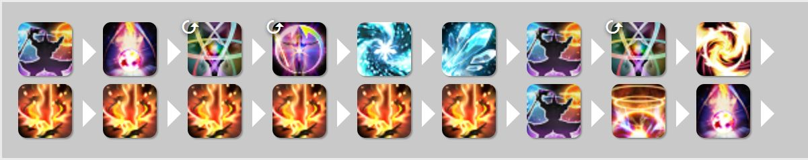

*图 1｜单体基准循环*

> **注释 3｜图 1：基准循环，全篇的平均线**
> 13 个技能位：`冰3 290 ＋ 冰4 300 ＋ 冰悖论 540 ＋ 火3[火1] 406 ＋ 火4×6 3240 ＋ 火悖论 540 ＋ 耀星 900 ＋ 绝望 630 ＝ 6846`，所以 `Q = 6846 ÷ 13 = 526.62`。
> 基准自身 `p = 6846 − 13Q = 0`。常用差值：火4 `+13.4`、绝望 `+103.4`、耀星 `+373.4`；同位替换只比差值（绝望→火4 `−90`）。
> 边界：图首的 A、D 是上一段结尾，不计入本段。

### 2.等效威力算法

本质是割补法，该算法多用于计算由特化而引入的额外高威力技能的实际威力，通常是将高威力技能的威力割补，将前边降级的技能恢复到原初威力得出高威力技能的等效威力(如核爆起手，本质是将绝望(350威力)降级成核爆(240威力)，而降级造成的损失带来了一个额外的耀星(500威力)，则该耀星的等效威力其实是500-(350-240)=390)；亦或是引入某个技能会引起后续循环的威力盈损变动，则可以将后续盈损与该技能本身威力加和得到其等效威力

> **注释 4｜等效威力：只是把损失并到一发上看**
> 原文：绝望 350 降级成核爆 240，损失 110 并进耀星 → `500 − 110 = 390`。
> 本文口径（三档火 ×1.8）：`900 − (630 − 432) = 702`；再扣一个技能位，才是核爆起手的 `702 − Q ≈ 175.4`。
> 所以等效威力回答"这笔交易换来多少"，不等于净收益。

## 四、特化循环介绍(仅正收益或低亏损)

### 1.命名规则

仍沿用7.1版本的用A和U分别表示火悖论和冰悖论，M表述魔泉，在介绍新规则前我们先来看7.2版本的最新特化起手，如图，我们起手选择放弃掉一个绝望与魔泉里的火悖论，魔泉前打5个f4并用魔泉打7个f4刚好凑齐两个耀星所需的12档星极魂，我们把这种 “放弃一个火阶段里的绝望且后接魔泉打7f4+绝望” 凑双耀星的结构称为“5+7”，而把有异于该结构的部分在前面写出(比如需要打b4在前边命名冰针，不跳过绝望则命名前写绝望，需要剩余蓝就写剩余蓝)

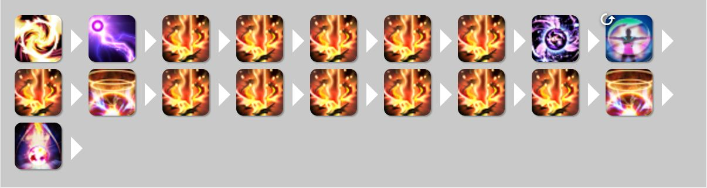

*图 2｜命名规则：5+7*

> **注释 5｜图 2：命名规则里的"5+7"**
> 核心 `火4×5 → M → 火4 → 耀星 → 火4×6 → 耀星 → 绝望`：12 火4 ＋ 2 耀 ＋ 1 绝望 ＝ 15 技能位、**8910** 威力（M 是能力技，不计位）。
> 对起手账本（8100／14，见前文）：`p = (8910 − 8100) − Q(15 − 14) = 810 − Q ≈ 283.4`。

### 2.特化介绍

##### 5+7起手    p=283.4

*图 3｜5+7 起手*

> **注释 6｜图 3：5+7 起手（第一张）**
> 同样是 8910／15 对 8100／14。换个拆法核对：多一个耀星 `+900`、绝望降级成火4 `−90`、火悖论换成等威力火4 `±0` → `900 − Q − 90 ≈ 283.4`，两种算法一致。
> ⚠ 未计"下一轮没有火苗"的隐性损失：若被迫从冰3 起火3，单发 `203 − 406 = −203`（后文 A3 标改就是为解决它）。

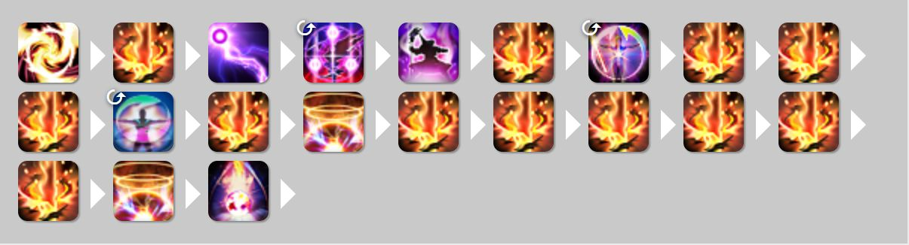

*图 4｜5+7 起手（能力技位置变体）*

> **注释 7｜图 4：5+7 起手（能力技位置变体）**
> 技能数量、威力与图 3 完全相同（8910／15），只是能力技和雷换了位置 → `p ≈ 283.4`。
> p 相同不等于副本里等价：雷放哪里决定团辅覆盖与 DoT 截断。

上文提的特化起手，起手将  绝望降级为f4  并将魔泉中的火悖论换成f4打双耀星，不打火悖论会导致没有火苗打标改造成隐性亏损(p=-203)，不过我们在这里先忽略掉这个亏损，原因下文解释，而在某些存在上天的副本，可以在确定有断雷容错区间后适当延后起手的雷，让雷可以打进团辅并联用三连和即刻作跳板，提供魔泉的启动窗口。

##### 新短改标改(A3标改)  p=0(冰火悖论都不加档数了哦)

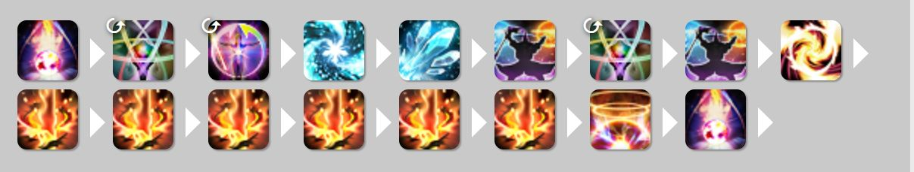

*图 5｜A3 标改*

> **注释 8｜图 5：A3 标改为什么是 p = 0**
> `冰3[冰1] → B4 → U → A[火1] → 火3[火1] → 火4×6 → 耀 → D`：13 技能位、6846 威力，只是把 A 提前用来产火苗 → `p = 6846 − 13Q = 0`。
> A 是悖论、固定 540，不升档，所以后续火3 仍按 406 算（不能按 522）。代价是机动性下降，并锁住其他依赖火苗的特化。

由于新版本星极火持续时间变为永久，现在黑魔法师的标改可以做到火苗自产自销，这也是介绍5+7时提到忽略跳过火悖论带来的隐形亏损的原因。该循环多在使用5+7或是类5+7路线后使用 ，其会导致机动性大幅下降并禁用掉许多依赖火苗的特化直到我们通过魔泉或是特化获取到新的火苗(ps：命名仅是致敬6.x版本的新短循环)

##### 核爆起手  p=175.4

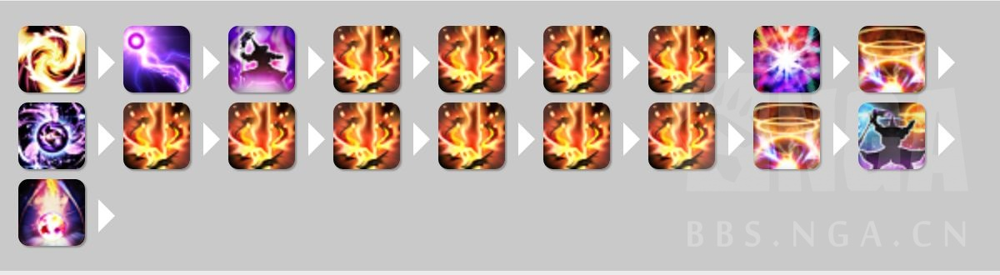

*图 6｜核爆起手*

> **注释 9｜图 6：核爆起手**
> `火4×4 → 核爆[火3] → 耀星 → M → 火4×6 → 耀星 → 火悖论 → 绝望`：10 火4 ＋ 1 核 ＋ 2 耀 ＋ 1 A ＋ 1 D ＝ 15 技能位、`10×540 + 432 + 1800 + 540 + 630 = 8802`。
> 对 8100／14：`(8802 − 8100) − Q(15 − 14) = 702 − Q ≈ 175.4`；等价于"耀星 900 − 绝望降核爆 198 − 一个技能位"。

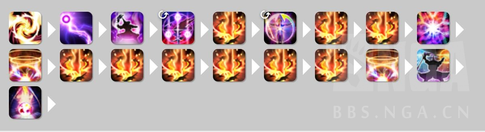

*图 7｜核爆起手（不打盈余火4）*

> **注释 10｜图 7：不打那发盈余火4 的核爆起手**
> 核爆前只有 3 发火4：9 火4 ＋ 1 核 ＋ 2 耀 ＋ 1 A ＋ 1 D ＝ 14 技能位、`9×540 + 432 + 1800 + 540 + 630 = 8262` → `(8262 − 8100) − Q(14 − 14) = 162`。
> 交叉验证：`175.38 − (540 − Q) ≈ 162`。
> ⚠ 原帖把两张图都写 175.4；175.4 只对应打了盈余火4 的那一版。

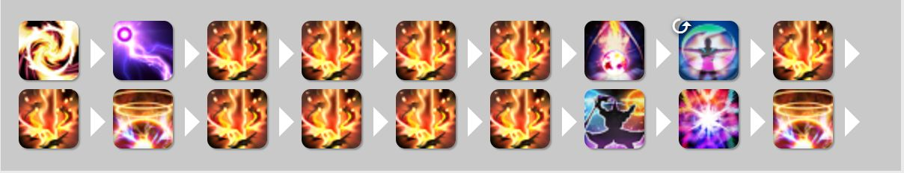

*图 8｜核爆后置起手*

> **注释 11｜图 8：核爆后置版本**
> `火4×4 → 绝望 → M → 火4×2 → 耀星 → 火4×4 → 火悖论 → 核爆[火3] → 耀星`：同样是 8802／15 → `p ≈ 175.4`。
> 换序不改威力账，只改核爆、耀星、瞬发的落点（作者据此说后置泛用性更高）。

5+7起手会导致下个魔泉前的所有标改都需要换机动性较低的新短改标改，不想承担此后果则可以换成此起手，核爆起手有一个盈余的f4可根据副本情况决定打或不打
ps：一般来说，核爆后置的版本泛用性会更高

##### 截断起手  p=79.8

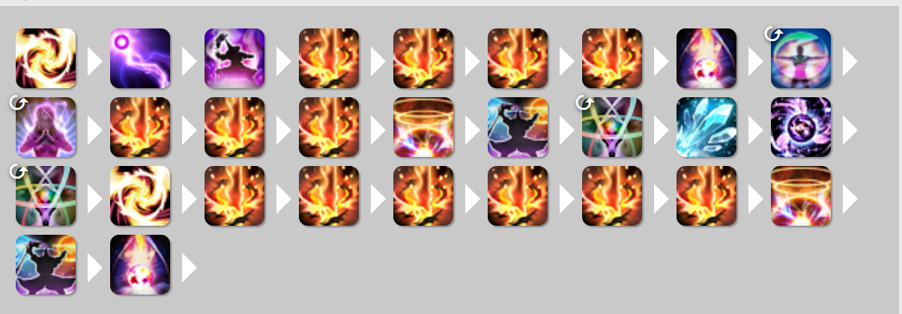

*图 9｜截断起手*

> **注释 12｜图 9：截断起手，以及那 0.1 的差**
> 核心 `火4×4 → D → M → 火4×3 → 耀 → 冰悖论 → B4 → 火3[火1] → 火4×6 → 耀 → 火悖论 → D`：13 火4、2 D、2 耀、2 悖论、1 B4、1 火3 ＝ 21 技能位、**11866** 威力。
> 跨度对不上单段基准，参照取"起手账本 ＋ 一段基准" ＝ `8100 ＋ 6846 = 14946`、`14 ＋ 13 = 27`：`p = (11866 − 14946) − Q(21 − 27) = −3080 ＋ 6Q = 79.69 ≈ 79.7`。
> ⚠ 原帖写 79.8；改用显示值 526.6 反而得 79.6。这 0.1 的原因没找到，如实记录。

在7.1死掉的7.05起手在7.2打赢复活赛了， 需要醒梦。相对5+7起手和核爆起手亏损太多，仅在需要增g或调整瞬发位置时考虑使用，该起手也同核爆起手有一个盈余的f4。

##### 冰针5+7  p=106.5

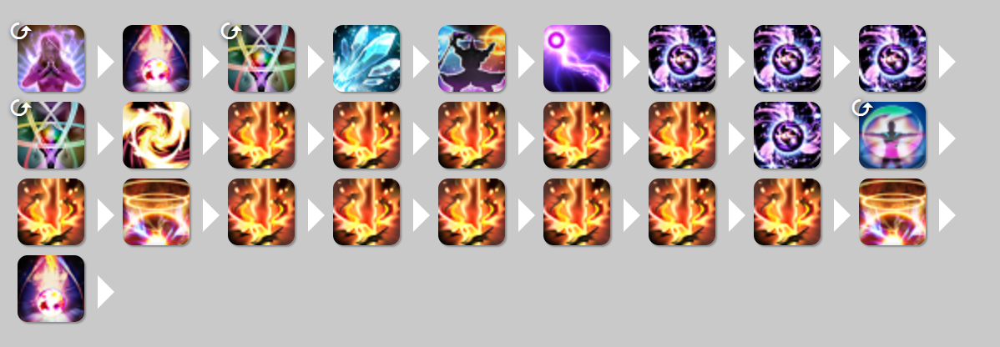

*图 10｜冰针 5+7*

> **注释 13｜图 10：冰针 5+7（不是起手）**
> **它不是起手**：自带一次完整魔泉，是循环中段的结构。对照窗口＝"基准循环 ＋ 一次常规魔泉火段" ＝ **12156／22**（见前文账本表）。
> 核心 `B4 → U → 火3[火1] → 火4×5 → M → 火4 → 耀 → 火4×6 → 耀 → D`：18 技能位、**10156** 威力 → `p = (10156 − 12156) − Q(18 − 22) = 106.46 ≈ 106.5`。
> 错用单段基准会得 `10156 − 18Q ≈ 676.9` —— 把本结构自带的魔泉收益算成了自己的成绩。
> 机制背景：紧急爆发用，**把攒着的异言全部丢出去**；砍 1 次冰3 改用醒梦（醒梦 AF 下不回蓝，要靠在 UI 里用异言这类瞬发拖时间）；相对基准循环的火阶段砍掉一发火悖论、一发火4 和绝望，省 `1600 ＋ 1600 ＋ 800 = 4000` 蓝。

需要火苗，需要醒梦。需要至少5600蓝进火，瞬发耗费极高的特化

##### 冰针绝望5+7  p=209.8

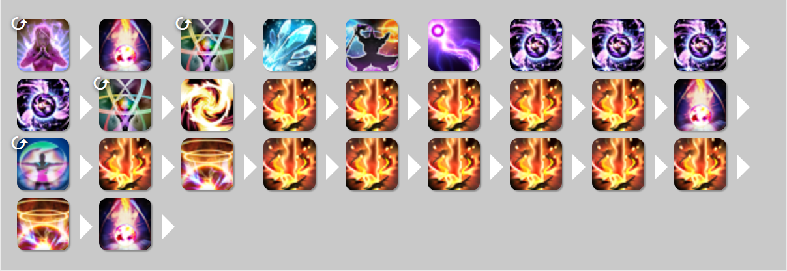

*图 11｜冰针绝望 5+7*

> **注释 14｜图 11：冰针绝望 5+7**
> 在上一条的 5 发火4 之后、M 之前多一发绝望：19 技能位、`10156 ＋ 630 = 10786` → `p = (10786 − 12156) − Q(19 − 22) = 209.85 ≈ 209.8`。
> 增量写法：`106.46 ＋ (630 − Q) = 209.85`。若拿已显示的 106.5 继续加，会得 209.9（提前舍入）。

需要火苗，需要醒梦。需要至少6400蓝进火，比冰针5+7消耗更多的瞬发

##### 单星灵冰针绝望5+7  p=64.8

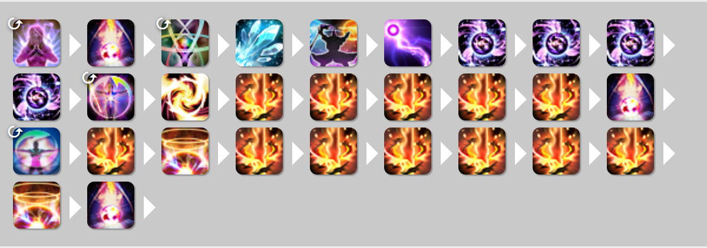

*图 12｜单星灵冰针绝望 5+7*

> **注释 15｜图 12：单星灵冰针绝望 5+7**
> 结构同上，但首次火3 用即刻在冰1 施放：`261 − 406 = −145`，技能位不变 → `209.85 − 145 = 64.85 ≈ 64.8`。
> 即刻是能力技，不占技能位；损失来自状态倍率。

需要至少6400蓝进火，需要醒梦，需要即刻

魔泉剩余蓝冰针6+6(魔泉剩余蓝冰4双)  p=106.5 需要火苗，需要醒梦，至少需要8000蓝进火，跳过魔泉里的火悖论和绝望，将蓝用于后续的6f4d冰4双，利用剩余蓝可以减少实际跳蓝需求

> **注释 16｜没有配图的「魔泉剩余蓝冰针 6+6」**
> 按原文文字重建：`M → 火4×6 → 耀 → B4 → U → 火3[火1] → 火4×6 → 耀 → D`，18 技能位、10156 威力，同冰针 5+7 → `p ≈ 106.5`。
> ⚠ 这是文字重建的账本，不是从独立原图验证的结论。

##### 剩余蓝冰针6+0(剩余蓝冰4双) p=119.8

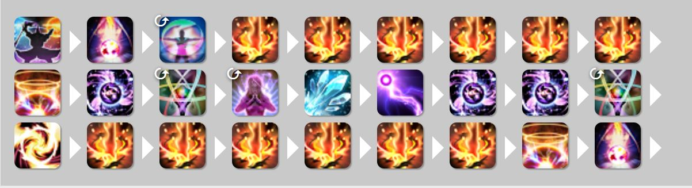

*图 13｜剩余蓝冰针 6+0*

> **注释 17｜图 13：剩余蓝冰针 6+0**
> 起点是上一条的 106.46。常态路线不能像魔泉那样省掉火悖论，要补回一发 A：`＋ (540 − Q) = 119.85 ≈ 119.8`。
> 直接核对：核心 12 火4、2 耀、1 D、1 B4、1 冰悖论、1 火3、1 火悖论 ＝ 19 技能位、**10696** 威力 → `p = (10696 − 12156) − Q(19 − 22) = 119.85`。
> ⚠ 依赖"两段常态路线与魔泉剩余蓝路线的共同项配平"这一假设；原图仍画着前段魔泉作衔接。

需要火苗，需要醒梦，需要至少8000蓝进火，+0表示此结构不需要魔泉，跳过第一个标改的绝望，将蓝留到后边打6f4d，比起魔泉剩余蓝，常态标改无法跳过火悖论，跳蓝需求大幅提高。

##### 剩余蓝冰针6+0改(剩余蓝冰4双改)  p=16.4

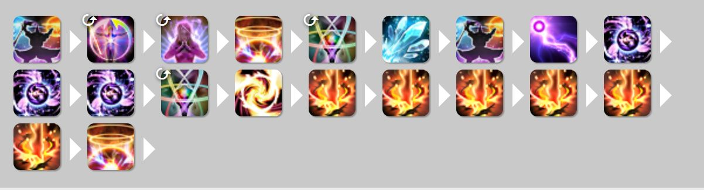

*图 14｜剩余蓝冰针 6+0 改*

> **注释 18｜图 14：剩余蓝冰针 6+0 改**
> 再省一发绝望：`−630 ＋ Q = −103.38` → `119.85 − 103.38 = 16.46`，完整精度应为 **16.5**。
> 原帖的 16.4 可由已显示的中间值复现：`119.8 − 630 ＋ 526.6 = 16.4`。原值保留，不修改作者数字。

需要火苗，需要醒梦，需要至少7200蓝进火，跳过绝望收益大大下降，但可以降低填充消耗

##### 2+7+核  p=198.3

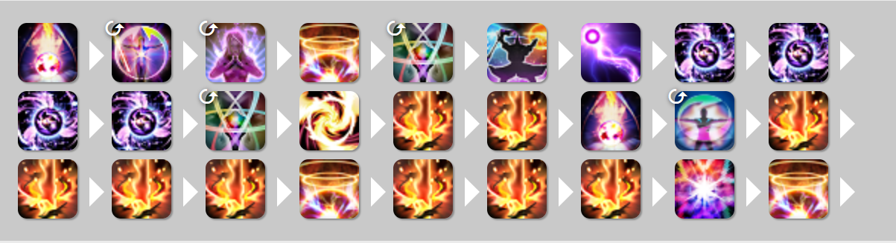

*图 15｜2+7+核*

> **注释 19｜图 15：2+7+核**
> 核心 `冰悖论 → 火3[火1] → 火4×2 → 绝望 → M → 火4×4 → 耀 → 火4×3 → 核爆[火3] → 耀`：15 技能位、`9×540 + 540 + 406 + 630 + 432 + 1800 = 8668` → `p = (8668 − 12156) − Q(15 − 22) = −3488 ＋ 7Q ≈ 198.3`。
> 核爆既出伤害又参与星极魂结构，不能因为 432 < 630 就判定整条结构亏。

需要火苗，需要醒梦，需要至少4000蓝进火，瞬发消耗极高(同冰针绝望5+7)，gcd数比冰针5+7短，因此互相不构成上下位关系。

##### 剩余蓝2+7+核  p=94.9

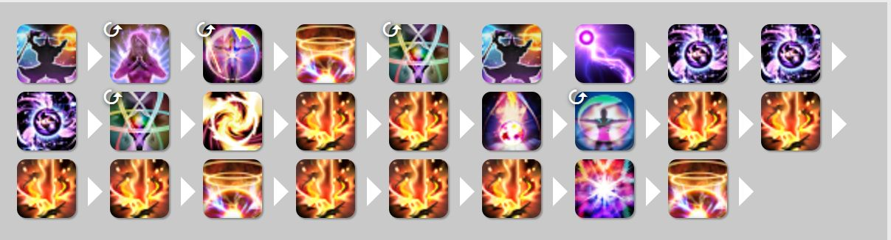

*图 16｜剩余蓝 2+7+核*

> **注释 20｜图 16：剩余蓝 2+7+核**
> 后段与上条接近，但蓝来自前段省掉的一发绝望：`−630 ＋ Q = −103.38` → `198.31 − 103.38 = 94.92 ≈ 94.9`。
> 只从后段往后数会漏掉这笔前置代价。

需要火苗，需要醒梦，需要至少4000蓝进火，核爆代替绝望可以帮助我们积蓄额外的星极魂，剩余蓝可以减少填充消耗。

##### 一档核爆魔泉双耀星; p=-1.8

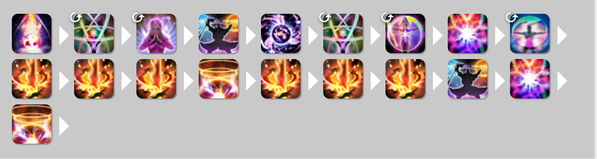

*图 17｜一档核爆魔泉双耀星*

> **注释 21｜图 17：一档核爆魔泉双耀星**
> `冰悖论 → 核爆[火1] → M → 火4×3 → 耀 → 火4×3 → 火悖论 → 核爆[火3] → 耀`：首核施放前只有火1，按 `240 × 1.4 = 336`；次核按 432。12 技能位、`540 + 336 + 3240 + 540 + 432 + 1800 = 6888` → `p = (6888 − 12156) − Q(12 − 22) = −5268 ＋ 10Q ≈ −1.8`。
> 略亏，属补 G 用的低亏损结构：比 U3d 的 −3.8 好，且不需要火苗。

需要醒梦，补g用，比u3d亏损更低且不需要火苗

##### 冰针绝望2+核+7  p=75.1

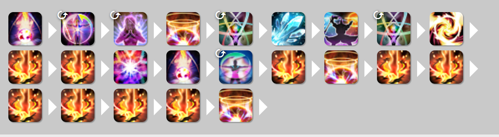

*图 18｜冰针绝望 2+核+7*

> **注释 22｜图 18：冰针绝望 2+核+7（图示边界疑点）**
> 按图中所画（止于最后一个耀星）：9 火4、1 B4、1 冰悖论、1 火3、1 核、1 绝望、2 耀 ＝ 16 技能位、**8968** 威力 → `p = (8968 − 12156) − Q(16 − 22) = −3188 ＋ 6Q ≈ −28.3`。
> 再补一发图里**没有画出**的绝望：`−28.31 ＋ (630 − Q) = 75.08 ≈ 75.1`，与原帖吻合。
> ⚠ 只能记作"补计一发绝望后吻合"，不擅自把那发补进原序列。

需要火苗，需要醒梦，需要至少4000蓝进火，相对剩余蓝2+核+7，b4大幅降低了跳蓝需求，收益也依旧可观

##### 冰针3+核+0  p=-14.9

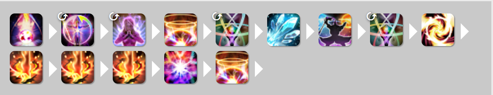

*图 19｜冰针 3+核+0*

> **注释 23｜图 19：冰针 3+核+0**
> `B4 → 冰悖论 → 火3[火1] → 火4×3 → 核爆[火3] → 耀星`，不需要魔泉：8 技能位、`300 + 540 + 406 + 1620 + 432 + 900 = 4198` → `p = 4198 − 8Q ≈ −14.9`。
> 略亏，但不消耗填充资源，可用于调轴。

需要火苗，需要醒梦，需要至少3200蓝进火，低亏损循环，但是不耗费填充资源，可用于调轴

##### 剩余蓝3+核+0  p=108.3

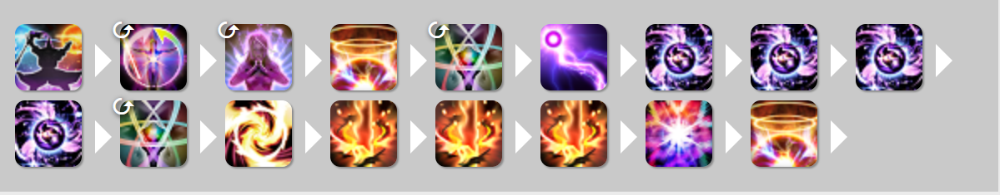

*图 20｜剩余蓝 3+核+0*

> **注释 24｜图 20：剩余蓝 3+核+0**
> 后段 `火3[火1] → 火4×3 → 核爆[火3] → 耀星`：6 技能位、`406 + 1620 + 432 + 900 = 3358` → 单算 `3358 − 6Q ≈ 198.3`。
> 原图前端用火悖论而非绝望衔接：同一技能位 `630 − 540 = −90` → `p = 198.31 − 90 = 108.31 ≈ 108.3`，对上原帖。
> ⚠ 依赖"前端 D→A 一换一"的跨段假设；换个省蓝方式就要重建前段。

需要火苗，需要醒梦，需要至少5600蓝进火，瞬发耗费极高(同冰针绝望5+7)

##### U3d  p=-3.8

*图 21｜U3d*

> **注释 25｜图 21：U3d**
> `冰悖论 → 火3[火1] → 绝望[火3]`：3 技能位、`540 ＋ 406 ＋ 630 = 1576` → `p = 1576 − 3Q ≈ −3.8`（三发均值 525.3，几乎正好等于 Q 526.6）。
> 名字：U＝冰悖论、3＝火3、d＝绝望，**不是三个绝望**。

需要火苗，需要醒梦，补g用

##### UM  p=13.4

*图 22｜UM*

> **注释 26｜图 22：UM**
> 与同样要用一次魔泉、后续火段相同的路线相比，多出来的只有一发冰悖论：`p = 540 − Q ≈ 13.4`（后续共同火段整体抵消）。
> 这不是"整张图只有 540 威力"，共同火段只是被抵消掉了。

只消耗一个瞬发，简单易用的补g手法

##### AM  p=13.4

*图 23｜AM*

> **注释 27｜图 23：AM**
> 同理，抵消共同火段后多一发火悖论：悖论冰火同价 540 → `p = 540 − Q ≈ 13.4`。与 UM 的区别是 **A 额外给一个火苗**。
> A 在火1 施放不乘 1.4、也不升档。

需要至少1600蓝进火，需要醒梦，提供额外的火苗，可用于补g

##### 即刻一档冰f3  p=-145

*图 24｜即刻一档冰 F3*

> **注释 28｜图 24：即刻一档冰 F3**
> 同一发火3 从火1 改到冰1 施放：`261 − 406 = −145`，技能位不变。即刻是能力技，不再额外扣 Q。
> ⚠ 原图在绝望之后直接画冰3、没画移位。若冰3 也是从火3 直接放，冰3 本身再从 290 降到 `290 × 0.7 = 203`（再亏 87），合计 `−232`。所以 −145 只代表火3 这一项。

亏损循环，消耗两个填充，但提供火苗，仅与高收益结构联用

##### A即刻b3  p=-29

*图 25｜A 即刻 B3*

> **注释 29｜图 25：A 即刻 B3**
> A 与它替换掉的冰悖论都是 540，先抵消；A 不升档，所以即刻冰3 仍在火1：`261 − 290 = −29`（两个冰3 各占一个技能位）。
> 想避免这 29，就要多花填充先星灵移位回冰1 再打。

需要至少1600蓝进火，需要醒梦，需要即刻，提供火苗，耗费更多填充打一档冰b3可以避免亏损。

##### 剩余蓝A即刻b3  p=-132

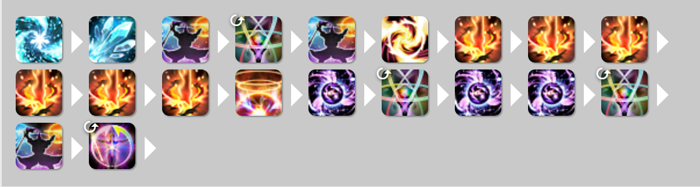

*图 26｜剩余蓝 A 即刻 B3*

> **注释 30｜图 26：剩余蓝 A 即刻 B3**
> 在上一条 `−29` 的基础上，再扣前段省掉一发绝望的代价 `−630 ＋ Q = −103.38` → `−132.38`。原帖按整数写 **−132**（一位小数是 −132.4）。
> ⚠ 原图末尾只画到"即刻"，没画出标题里的那发冰3；本式按标题补入。

需要即刻，提供火苗， 耗费更多填充打一档冰b3可以降低亏损

##### B4A核核耀 p=-125

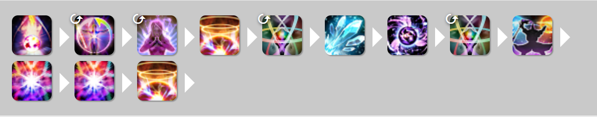

*图 27｜B4A核核耀*

> **注释 31｜图 27：B4A核核耀**
> `B4 → 火悖论[火1] → 核爆[火1] → 核爆[火3] → 耀星`：悖论不升档，所以首核按 336、次核按 432。5 技能位、`300 + 540 + 336 + 432 + 900 = 2508` → `p = 2508 − 5Q ≈ −125.1`，原帖取整 −125。
> 常见错误：把两发核爆都按 432 算，会得 ≈ −29，等于凭空抹掉 96 的亏损。

需要醒梦，需要至少4000蓝进火，提供火苗

### AOE循环

#### 双目标

##### b4U核核耀 p=0

*图 28｜双目标 B4U核核耀*

> **注释 32｜图 28：双目标基准**
> 多目标规则：核爆对次目标 70%、耀星 35%；**B4 与悖论是单体威力，不乘目标数**。
> 双目标核心 `B4 → 冰悖论 → 核爆[火1] → 核爆[火3] → 耀星`：5 技能位、`300 + 540 + 336×1.7 + 432×1.7 + 900×1.35 = 3360` → `Q₂ = 672`，自身 `p = 0`。
> 多目标不能用单体的 526.6，必须换同目标数的基准。

均g威力672，双目标基准循环

##### B4核核耀  p=132

*图 29｜双目标 B4核核耀*

> **注释 33｜图 29：双目标跳过冰悖论**
> 少一发冰悖论、省 1 个技能位：`2820 − 4×672 = 132`，即 `672 − 540`。图中的秽浊按双方共同填充处理。
> 前提是两边填充的伤害与资源真的能抵消；若新路线多消耗一枚通晓，就要另算。

使用dot或通晓填充跳过冰悖论，注意秽浊加强后双目标已再次强于异言

### 关于双目标的雷

在双目标环境下，群雷的总威力为840，而如果我们选用单体雷易得：第二个雷的等效威力约为750-(840-750)=660，(在这里我们先忽略掉上两个单雷之间的间隔导致的天然雷损)不难发现，第二个高闪雷的等效威力660已小于双目标基准循环均g威力672，不过这并不代表dot使用群雷就一定优于单体雷——雷并不只是一个单纯的伤害技能，亦是一个重要的填充技能，它可以提供窗口使用星灵移位以及代替掉冰悖论，双目标环境中单体雷使用频率为2个/30s，高\*\*\*\*雷的1个/24s，这也意味着第二个单体雷的实际等效威力也许远高于660。因此我们在长时双目标环境下仍优先考虑上两个单雷，而仅在资源冗余或者gcd冗余时的某些短时阶段(如绝伊甸p4)考虑将部分单体雷换成群雷

> **注释 34｜双目标的雷：660 是怎么来的**
> 单体雷 750、双目标群雷 840：第二发单体雷占第二个技能位的等效威力是 `750 − (840 − 750) = 660`，比双目标平均线 672 低约 12。
> 但雷同时是填充：它提供瞬发窗口（插移位、跳过冰悖论）。原文给双目标单体雷 2 个/30s、群雷 1 个/24s，所以长时双目标仍优先两个单雷，只在资源或 GCD 冗余的短阶段（如绝伊甸 P4）换群雷。
> ⚠ 未计两发单雷之间的天然雷损。原文被 NGA 屏蔽的 `高****雷` 照录。

#### 三目标

##### 玄冰U核核耀 p=0

*图 30｜三目标 玄冰U核核耀*

> **注释 35｜图 30：三目标基准**
> 冰技能改用玄冰（120／目标）；核爆累计倍率 `1 ＋ 0.7×2 = 2.4`、耀星 `1.7`：`120×3 + 540 + 336×2.4 + 432×2.4 + 900×1.7 = 4273.2` → `Q₃ = 854.64`（原帖显示 854.6），自身 `p = 0`。
> 玄冰的 AOE 倍率只适用于玄冰，不能套到单体的冰悖论上。

三目标基准循环中，冰技能的选择从冰4变成了玄冰，ppg为854.6

##### 玄冰核核耀  p=314.6

*图 31｜三目标 玄冰核核耀*

> **注释 36｜图 31：三目标跳过冰悖论**
> 省一发冰悖论：`3733.2 − 4×854.64 = 314.64 ≈ 314.6`，即 `854.64 − 540`。
> 用显示值 854.6 会得 314.8 —— 差 0.16，来自提前舍入。

三目标及以上时dot选择均为高震雷

#### 四目标及以上(仅理论，不含计算)

##### 玄冰群雷核核耀

*图 32｜四目标以上 玄冰群雷核核耀*

> **注释 37｜图 32：四目标以上的群雷版本（原帖没有 p）**
> 原文明确标"仅理论，不含计算"。若以同目标数的"玄冰 → 冰悖论 → 核爆×2 → 耀星"为参照，两边都是 5 技能位，差额可写成 `p = T − 540`。
> T 是本次群雷**真正新增的有效伤害**：直伤 ＋ 实际新增 DoT 跳数 − 被覆盖掉的旧跳数。目标上天、死亡、提前刷新都会改变 T，所以给不出固定数字。

四目标及以上时，群雷仅直伤就有很可观的威力，加上刷新dot的效果，等效威力已高于冰悖论

##### 玄冰核核耀

*图 33｜四目标以上 玄冰核核耀*

> **注释 38｜图 33：用秽浊跳过群雷**
> 原帖没有这一组的 p。注释按"同目标数、同填充"另选参照：参照总威力 `120n + 540 + 768[1+0.7(n−1)] + 900[1+0.35(n−1)] = 972.6n + 1355.4`，5 技能位 → `Qₙ = 194.52n + 271.08`。
> 本结构省掉一发 540 的冰悖论、技能位不变：`p = Qₙ − 540` → 4 目标 `1049.16 − 540 = 509.16`、5 目标 `1243.68 − 540 = 703.68`。
> ⚠ 这两个数是注释补的，原帖没有；也未计秽浊本身的使用代价。

利用秽浊跳过低等效威力的群雷能大大提高aoe质量

##### 玄冰U核核耀(仅4-5目标)

*图 34｜四至五目标 玄冰U核核耀*

> **注释 39｜图 34：有限阶段里冰悖论怎样反超群雷**
> 与群雷版同为 5 技能位，差额是 `540 − T`。长木桩 T > 540 → 群雷赢；短阶段频繁截雷使 T < 540 → 冰悖论赢。
> 若按上一条定义的 U 参照，本结构自身 `p = 0` —— 这是**注释选参照的定义**，不是原帖给四五目标公布了 0。

在长时木桩环境下，4目标及以上群雷确实是优于冰悖论，但在一个时长有限的多目标环境下，频繁的截雷会导致某几个高震雷的等效威力仅等于直伤威力，这时冰悖论又会反超这几个群雷的威力

##### 单星灵玄冰核核耀

*图 35｜单星灵 玄冰核核耀*

> **注释 40｜图 35：HF2 替代填充**
> `玄冰 → HF2[冰1] → 核爆[火3] → 核爆[火3] → 耀星`：HF2 把首核从 336 升到 432，多出 `96 × [1 + 0.7(n−1)]`。
> 与同目标数 U 路线同为 5 技能位，若 HF2 本次有效总威力为 H：`H − 540 + 96 × [1 + 0.7(n−1)]`。
> HF2 读条长于普通 GCD 时不能只数图标，还要扣 `Qₙ × 额外时间 ÷ 2.5`，或直接比 PPS。原文没有固定 p（要指定瞬发覆盖）。

Hf2可以将第一个核爆升级为三档核爆，在时长有限的多目标环境下填充资源紧缺时可代替群雷填充，在黑魔纹里使用也可有效节约填充资源，由于hf2的咏唱时长仍大于gcd时长，因此如果能用三连/即刻覆盖也能获得额外的收益，需要注意的是，在四目标环境下，一档冰长读条hf2的等效pps仍略低于冰悖论，但如果是在黑魔纹里，一档冰长读条hf2仍可代替冰悖论以规避星灵移位cd回转问题

## 五、实战向特化理论——冰火循环中被耀星体系孤立的冰悖论与绝望

省流：悖论和绝望不是非打不可 众所周知，耀星的使用前置是六档星极魂，在单体循环中即使用6个火4。而在大部分情况，我们至少需要使用b34来获得6个火4所需蓝量，再通过火3进入三档星极火，然后咏唱6个火4，方能使用耀星。因此我们可以得出一个完整的耀星体系为“b34+火3+火4\*6+耀星”，将耀星体系与基准循环(标准循环改)对比后可以得出，他们之间的差别是火3的档数，以及耀星体系中并不刚需冰悖论与绝望(如果你本身带有火苗实际上火悖论亦非刚需)——标准循环改中冰悖论的作用为提供窗口来使用星灵移位，但能达成此目的的技能还有异言与雷甚至是三连咏唱。而尽管绝望也同理被孤立于耀星体系，但因其在 7.1 7.2的强悍性能，笔者不认为绝望会有被放弃的场景，它应当是最后再考虑优化的技能。那么这个理论的应用场景是什么呢？ 第一就是攻略之前提到的无效减时理论，跳过冰悖论/火苗可以让你在后续后续循环中打出威力更高的火4甚至耀星，但请不要矫枉过正引入了额外的b34。 7.2黑魔再无减时理论，时代变了大人。但是在存在上天的副本，仍然可能存在无效减时 (打咏速魔晶石也是减时) ，这些无效减时我们可以用于卡g开能力技/吃爆发药。第二，跳过了某个冰悖论/三档火火苗会让后续所有gcd都提前1g，导致瞬发窗口偏移，可能会让轴从可用变为不可用，或是从不可用/难用变成可用。第三则是爆发药/团辅的覆盖，在进行绝伊甸排轴时，由于绝伊甸中存在大量的上天与持续时间较短可选中阶段，黑魔法师往往很难正好倾泄掉手上所有资源，这时技能的使用选择以及使用顺序就有了很多讲究。以绝伊甸p2开场为例，p2开场是团辅期，为了更高的团伤，我们应该把尽可能多的异言打在团辅期，所以在协助改良轴的时候，笔者提出了跳过了第一个冰悖论的建议，使得更多的异言落在了团辅里。(其实事实上这个悖论并没有被跳过，原轴为绝望收尾改良后则是绝望后的冰悖论收尾，轴威力并没有任何改变但由于团辅和爆发药内威力分布变高因而团伤变高了)而在7.2，如果我们发现无法打出最后一个耀星，则可以根据实际情况通过增g/减g循环或是跳过悖论、火苗、绝望实现跳过结尾多余的一组b34/刚好打出来耀星。

> **注释 41｜第五节：耀星体系与被孤立的悖论、绝望**
> 耀星骨架 `B3 ＋ B4 ＋ 火3 ＋ 火4×6 ＋ 耀星` ＝ 10 个技能位，说明的是"拿蓝 → 进火 → 攒 6 档星极魂 → 耀星"的关系，**不是一个闭合循环**。
> 跳过悖论/绝望本身不增伤：单看基准，新增一发 A 或 U 值 `540 − Q ≈ +13.4`，一发 D 值 `+103.4`。收益只能来自：① 避免结尾多余的一组 b34；② 把技能挪进团辅/爆发药；③ 阶段结束前正好多打出一个耀星。为了省悖论反而多打一组 b34，就会抵消。
> 增 G／减 G ＝ 在轴里加/减一个技能位；少一发通常让后续窗口提前 1 GCD（实际还受读条、卡 G 影响）。
> "无效减时"＝提前后没有换来额外可命中技能的这段时间，可换成能力技或药的窗口，不是允许停手。
> 绝伊甸 P2：作者特别说明那个冰悖论**没有被删掉**，只是挪到末尾，整段原始威力不变，团辅与药内分布变高 —— 比的是落点与团伤，不是无增益的 p。

### 致谢

感谢番茄炒蛋群的各位提供的循环思路与计算数据，感谢岸谷新罗老师的排版

### 结语

不掉gcd真的已经很厉害了

### 附件

> **注释 42｜附件区这 22 张图**
> 以下是原帖"附件"区里**未插入正文**的图（含重复上传，例如 extra-09/10、extra-19/20 字节完全相同）。原样保留，不拿它们替换正文的 35 张。
> 完整 57 张列表见《原文快照-主楼.html》。

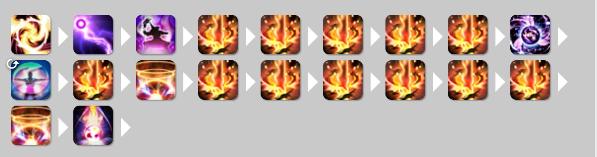

*附件 01｜未插入正文*

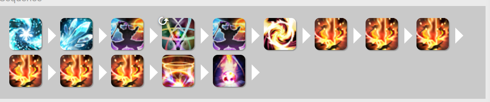

*附件 02｜未插入正文*

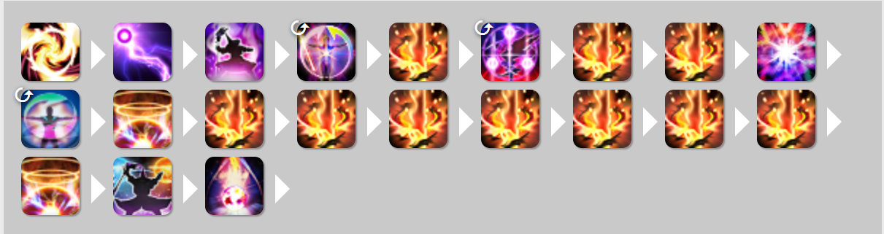

*附件 03｜未插入正文*

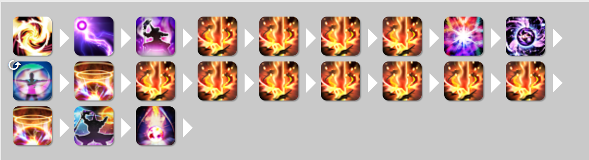

*附件 04｜未插入正文*

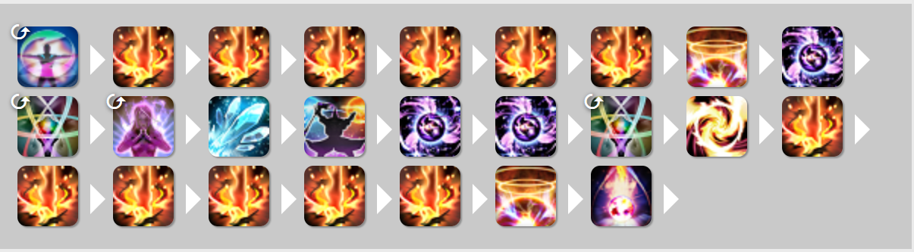

*附件 05｜未插入正文*

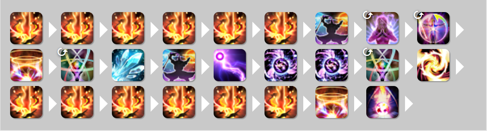

*附件 06｜未插入正文*

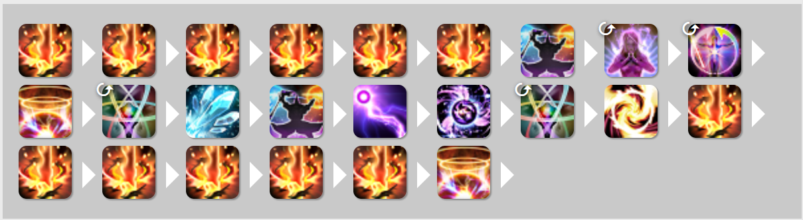

*附件 07｜未插入正文*

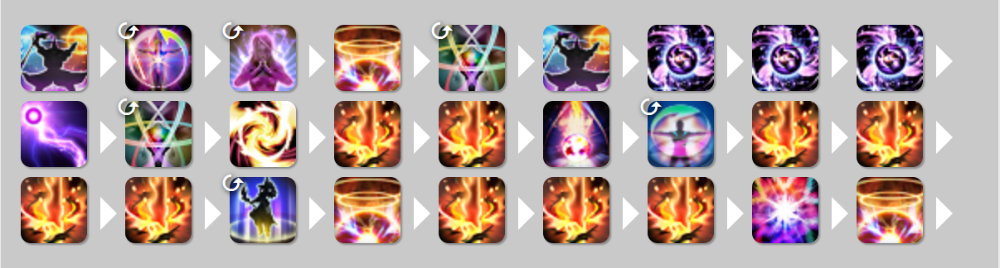

*附件 08｜未插入正文*

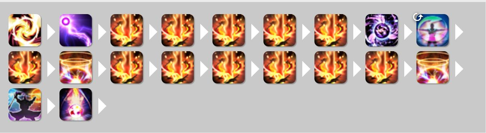

*附件 09｜未插入正文*

*附件 10｜未插入正文*

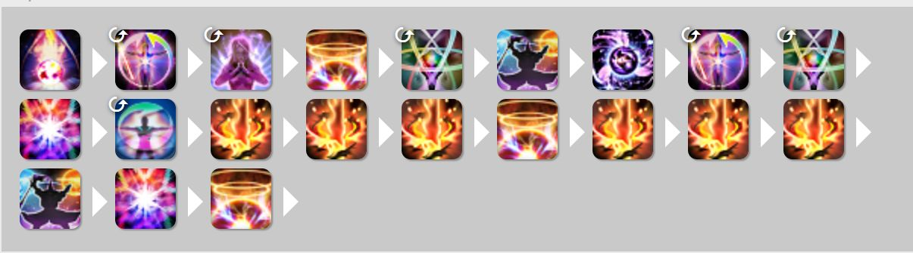

*附件 11｜未插入正文*

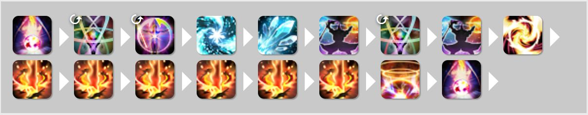

*附件 12｜未插入正文*

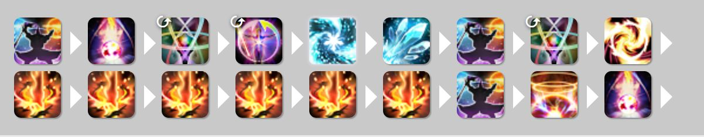

*附件 13｜未插入正文*

*附件 14｜未插入正文*

*附件 15｜未插入正文*

*附件 16｜未插入正文*

*附件 17｜未插入正文*

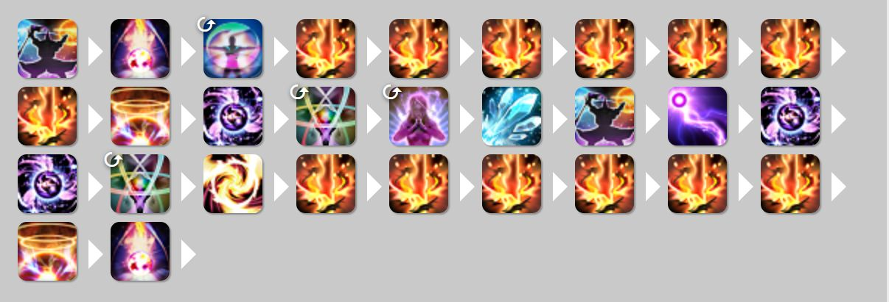

*附件 18｜未插入正文*

*附件 19｜未插入正文*

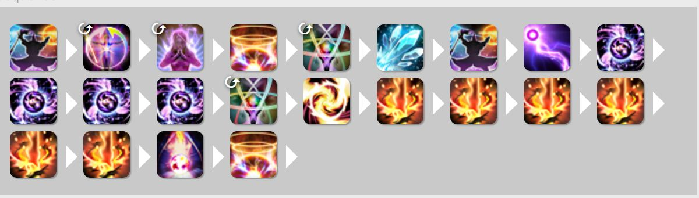

*附件 20｜未插入正文*

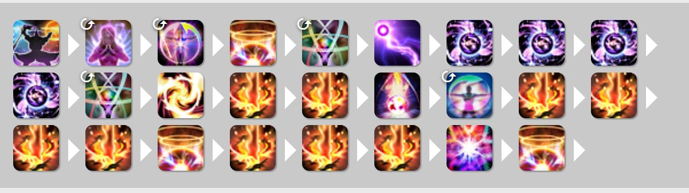

*附件 21｜未插入正文*

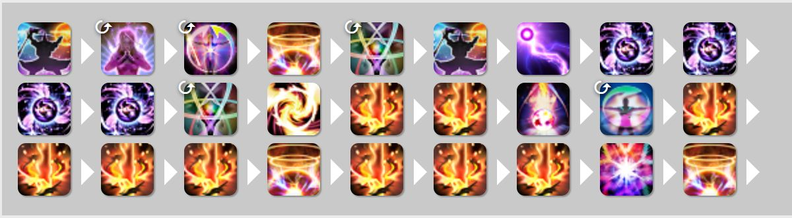

*附件 22｜未插入正文*
