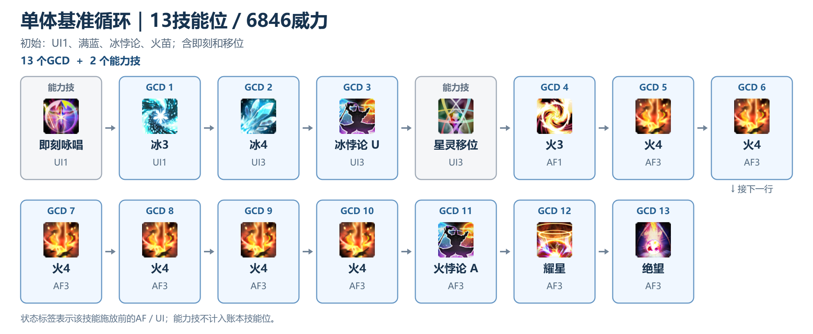
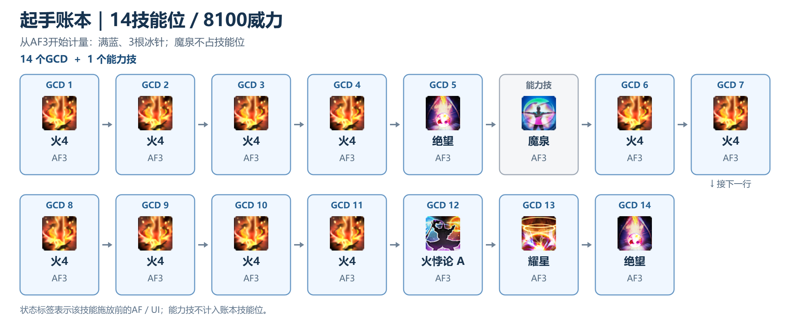
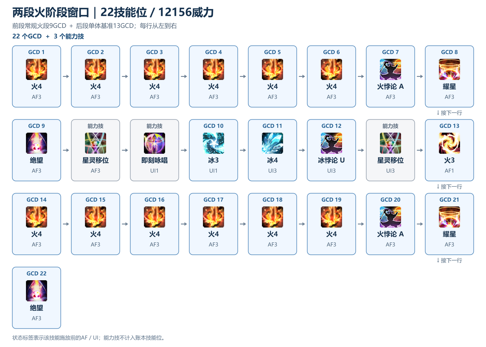
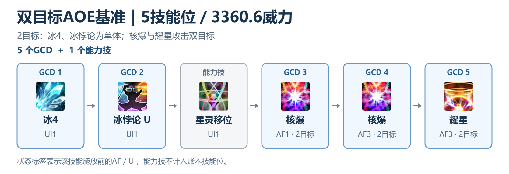
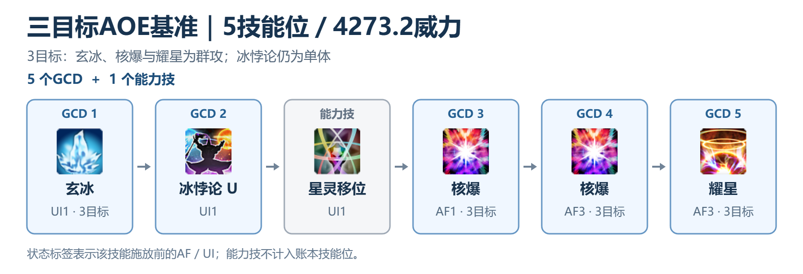

# 7.2黑魔进阶攻略

## 〇、口径与数值（注释补充，非原文）

**底本**：NGA 原帖 [tid 43757414](https://ngabbs.com/read.php?tid=43757414) 相关文件：[原文复刻件](7.2黑魔进阶攻略-原文复刻.md)　·　[复刻说明](复刻说明.md)　·　[原文快照-主楼.html](原文快照-主楼.html)

**简称**：F3/F4＝火3/火4，B3/B4＝冰3/冰4，A/U＝火悖论/冰悖论，D＝绝望，M＝魔泉，核＝核爆，耀＝耀星；AF/UI＝星极火/灵极冰＋档数；UH＝灵极心（冰针），AS＝星极魂。**冰4给3根冰针，即3层灵极心**；下文用“根／层”描述冰针资源，用“冰4／B4”描述技能。原文循环名中的“冰针”沿用作者写法。技能位按基础GCD 2.5秒归一化，实战受咏速与黑魔纹影响；超过GCD的读条和插入延迟必须另计时间。

**复审标记**：尚未解决的图文／数值疑点在对应位置用红色提示，计算依据与比较条件见相邻注释。

机制校对参考：[官方7.2更新说明](https://eu.finalfantasyxiv.com/lodestone/topics/detail/e8dc09ebc782c9c57de6489532ed55804541e0c7/)、[官方7.05更新说明](https://na.finalfantasyxiv.com/lodestone/topics/detail/da01b0d2d5434cd2ccfcc87f733df7a590f97c00)、[官方职业指南](https://na.finalfantasyxiv.com/jobguide/blackmage/)。职业指南是持续更新页；本文威力使用7.2数值，未套用后续版本的威力变动。

### 威力（本文口径，不含天语倍率）

| 技能 | 威力 |
| --- | ---: |
|  火4（AF3） | 540 |
|  耀星（AF3） | 900 |
|  绝望（AF3） | 630 |
|  悖论（冰火同价，且**不升档**） | 540 |
|  核爆（AF1 ／ AF3） | 336 ／ 432 |
|  火3（AF1 ／ UI1 ／ UI3） | 406 ／ 261 ／ 203 |
|  冰3 | 290 |
|  冰4 | 300 |
|  异言 | 890 |
|  高闪雷（30秒DoT跳满） | 750（150＋60×10） |

### MP 成本

| 技能／资源 | 基础耗蓝／资源规则 | AF3实际耗蓝（无UH时） | 备注 |
| --- | ---: | ---: | --- |
|  火3 | 2000 | 4000 | **有火苗时不耗蓝**；施放后直接进入AF3 |
|  火4 | 800 | 1600 | 本文火4均按AF3比较；每发增加1层AS |
|  火悖论 | — | 1600 | 不消耗UH；不按火系半价 |
|  冰悖论 | — | — | UI1–3 耗蓝为0 |
|  核爆 | 有UH：扣当前MP的2/3；无UH：扣光 | 同 | 施放前至少800 MP；有UH时消耗全部UH，另增加3层AS并进入AF3 |
|  绝望 | 扣光剩余 | 同 | 下限 800 |
|  耀星 | 0 | 0 | 消耗6层AS |
|  魔泉 | 恢复全部蓝 ＋ AF3 ＋ 云砧 ＋ 3层UH ＋ 点亮悖论 | | 在AF中使用；不会直接提供火苗 |
| 灵极心／冰针（UH） | 冰4给3根冰针；每根抵消一次火系魔法的AF耗蓝翻倍 | | 火4在AF3有UH时800、无UH时1600；核爆按上行特例，悖论不按火系半价 |
| 星极魂（AS） | 火4增加1层，核爆增加3层，上限6层 | | 用于耀星；转入灵极冰会清空，魔泉本身不提供AS |

**回蓝**：处于UI时命中冰属性魔法，按UI档数回蓝：UI1 2500／UI2 5000／UI3 10000，最高回到10000 MP。冰4、玄冰可利用此机制；冰3也不能一概写成不回蓝——先移位到UI再打冰3，与从AF直接打冰3的回蓝条件不同。冰悖论是无属性魔法，本身不触发冰属性命中的回蓝。醒梦按时间跳蓝，**AF下MP恢复被阻止**，这些特化在UI里用异言、雷等瞬发维持输出并等跳蓝。规则见[官方职业指南的极性与技能说明](https://na.finalfantasyxiv.com/jobguide/blackmage/)。

### 对照账本（注释采用的比较模型，原帖未逐条展开）

| 账本 | 技能位 ／ 威力 | 用于 | 依据 |
| --- | ---: | --- | --- |
| 单体基准循环 | 13 ／ 6846 | 图 1、A3 标改、U3d、即刻系、B4A核核耀及片段比较 | 图 1 自身，p = 0 |
| 常规火段账本 | 9 ／ 5310 | UM、AM及跨段省蓝代价；两段窗口的组成部分 | 6火4＋A＋耀星＋D；不含进火准备及共同填充 |
| 起手账本 | 14 ／ 8100 | 5+7、核爆、截断三组起手 | 常规起手核心：4火4＋绝望，接魔泉后的6火4＋火悖论＋耀星＋绝望 |
| 两段火阶段窗口（前段常规火段 ＋ 一段基准循环） | 22 ／ 12156 | 冰针系、剩余蓝系、2+7+核等 | 前段9技能位／5310威力，后段13／6846；前段可由魔泉启动，也可承接上一冰段 |
| 双目标 AOE 基准 | 5 ／ 3360.6 | 双目标 AOE 各结构 | 平均672.12；按核爆次目标70%、耀星35%求和，原文显示672 |
| 三目标 AOE 基准 | 5 ／ 4273.2 | 三目标 AOE 各结构 | 平均854.64；按核爆次目标70%、耀星35%求和，原文显示854.6 |
| n目标U参照（n≥4，注释定义） | 5 ／ 972.6n＋1355.4 | 四目标及以上理论结构 | 玄冰＋U＋AF1核爆＋AF3核爆＋耀星；平均Qₙ＝194.52n＋271.08，原帖未给此账本 |

起手账本的具体内容是 `火4×4 → 绝望 → M → 火4×6 → 火悖论 → 耀星 → 绝望`；常规火段是 `火4×6 → 火悖论 → 耀星 → 绝望`（9技能位、5310威力）。这些账本由技能序列显式求和，不是从显示p唯一反解出来的。

下文比较式为 `p模型＝(S目标−S参照)−Q×(G目标−G参照)`。只有参照自身满足 `S参照−Q×G参照＝0` 时，才等于原帖写的 `S目标−Q×G目标`。起手与两段窗口的参照本身含额外火段收益；因此下文数值吻合仅说明在所选共同项下能复现原文p，还须核查蓝量、火苗、通晓、能力技冷却与填充是否真的可配平。

以下流程图按账本计量窗口展开，**蓝框为GCD，灰框为能力技**，每行从左至右、再接下一行。共同项雷、异言等填充省略，技能位与威力沿用本文7.2口径。

#### 单体基准循环（13技能位／6846威力）

初始UI1、满蓝、持有冰悖论和火苗；从即刻冰3开始计量，图1首部上一段的A、D不计入本段。

#### 起手账本（14技能位／8100威力）

从AF3、满蓝、3根冰针开始计量；进火准备与共同填充在窗口外，魔泉不占技能位。

#### 两段火阶段窗口（22技能位／12156威力）

前段从AF3、满蓝、3根冰针、持有火悖论开始，为常规火段9技能位；接移位、即刻冰3进入后段13技能位基准循环。

#### 双目标AOE基准（5技能位／3360.6威力）

初始UI1、满蓝、持有冰悖论；冰4和冰悖论为单体，核爆与耀星命中两个目标。`300＋540＋336×1.7＋432×1.7＋900×1.35＝3360.6`，平均672.12。

#### 三目标AOE基准（5技能位／4273.2威力）

初始UI1、满蓝、持有冰悖论；玄冰、核爆和耀星命中三个目标，冰悖论仍为单体。`120×3＋540＋336×2.4＋432×2.4＋900×1.7＝4273.2`，平均854.64。

### 进火蓝量（原帖只给结果，下表算式由 MP 成本表推出）

| 阈值 | 结构 | 算式 |
| ---: | --- | --- |
| 1600 | AM、A即刻b3 | 火悖论 1600 |
| 3200 | 冰针3+核+0 | 3 发火4 按 800 ＝ 2400，核爆前留 800 |
| 4000 | 2+7+核、剩余蓝2+7+核 | 2 发火4 按 1600 ＝ 3200，绝望前留 800 |
| 4000 | 冰针绝望2+核+7 | 2发火4按800＝1600；核爆前留2400且仍有1层UH，核爆后剩800给紧接的绝望 |
| 4000 | B4A核核耀 | 火悖论1600且不消耗UH；首核前留2400，有UH时扣2/3，余800给无UH的第二核 |
| 5600 | 冰针5+7 | 3 发按 800 ＋ 2 发按 1600 |
| 5600 | 剩余蓝3+核+0 | 3 发火4 按 1600 ＝ 4800，核爆前留 800 |
| 6400 | 冰针绝望5+7、单星灵冰针绝望5+7 | 5600 ＋ 绝望前留 800 |
| 7200 | 剩余蓝冰针6+0改 | 3 发按 800 ＋ 3 发按 1600（这一版省掉绝望） |
| 8000 | 魔泉剩余蓝冰针6+6、剩余蓝冰针6+0 | 7200 ＋ 绝望前留 800 |

口径：只算**进火之后**的火系施放，不含火3 本身（标着"需要火苗"的路线可用火苗免费放火3）。
互证：`冰针3+核+0`（3200）与 `剩余蓝3+核+0`（5600）火阶段动作相同，差 `2400＝3×(1600−800)`，来自冰4的3层UH。这两条打完3发火4后均无UH，核爆会扣光余蓝；`6+0改`（7200）比 `6+0`（8000）少800，对应省掉绝望的最低蓝量要求。上述是进火后的成本下限；是否能及时回到该蓝量，还取决于UI停留时间、醒梦跳数和前段剩余蓝。

### 雷、异言与秽浊何时可以作为共同项抵消

通晓通常随天语每30秒增加一层，但异言／秽浊的实际使用次数还受初始库存、详述、溢出和结尾留存影响；高闪雷的名义DoT为30秒，实际刷新次数与有效伤害还受目标可选中时间、提前刷新及增益落点影响。它们的威力高于Q，并不意味着在任意比较窗口里次数与伤害自动相同。

只有双方填充的**次数、有效伤害与资源机会成本可配平**时，才可从双方的威力和技能位中同时扣除。填充仍占GCD；基础GCD为2.5秒时，核心技能位约为 `t÷2.5−雷次数−异言／秽浊次数`，而不是抵消后仍有 `t÷2.5` 个核心位。若某路线额外花一枚通晓或改变了雷覆盖，必须将该差异计回比较式；短阶段、上天和卡尾尤其需要逐轴处理。

### 注释读法

原文文字与原文p保留，注释给出条件化的复算、机制解释与疑点，不能当作作者原话。每条注释统一为 **i.账本对照 → ii.Δgcd → iii.p的计算 → iv.其他特殊说明**；`Δgcd＝G目标−G参照`，正数表示增G，负数表示减G。账本组合逐项相加；共同项抵消后的窗口不等同于全图动作数，能力技不计GCD。单体Q保留`6846÷13`完整精度至最后舍入，多目标采用对应Q₂／Q₃／Qₙ。起手8100／14、两段窗口12156／22是注释选定并按技能求和的参照模型。图注 `图 N｜…` 为本文件新增编号，补图 A 使用原帖附件19；所有配图校正与未验证边界均明示。

## 一、7.2改动

1. 除  冰3  ，  火3  ，  冰2  ，  火2  外，所有读条技能均改为 读条2s复唱2.5秒(不能无损插入能力技)
2. 冰3  和  火3  威力280→290，  火4  和  冰4  威力320→300，  耀星  威力400→ 500 ， 悖论 威力520→540，与三档炽炎威力相同但 不再提供相应的冰火层数 ，异言威力880→890，秽浊衰减60%→25%，天语倍率 32%→27%
3. 星极火和灵极冰 持续时间变为永久 ，云砧(雷云)和火苗 持续时间变为永久
4. 黑魔纹持续时间30s→20s

> **注释 1｜7.2 改动如何影响循环**
>
> **i. 账本对照**：不适用：本条说明7.2机制变化，不比较两条具体循环。
>
> **ii. Δgcd**：不适用；能力技不占GCD，但其插入延迟可能增加实际用时。
>
> **iii. p 的计算**：不计算整段p；机制决定后文每发技能的威力与资源消耗。
>
> **iv. 其他特殊说明**：基础读条2s、复唱2.5s时，剩余间隙约0.5s；常规能力技的无损插入通常需要瞬发窗口，并须考虑延迟与动画锁。冰火状态与火苗永久，但蓝量、星极魂、能力技冷却仍限制顺序。**悖论不提供冰火档数**：先打A后仍是AF1，后续火3按406、核爆按336，不能按522／432。黑魔纹改变单位时间技能数及填充窗口，静态单发威力无需乘黑魔纹，实战必须另计时间。

## 二、进阶循环的底层逻辑

有蓝打火没蓝打冰dot没了补dot黑魔循环优化的原理是： 设法提高低威力技能的威力甚至是跳过低威力技能 ，或是提高大威力技能在循环中出现的频率，在做到这些的同时同步设法降低雷损。而在这个版本，具体的操作即 多打耀星和少打冰3

> **注释 2｜"多打耀星、少打冰3"在比什么**
>
> **i. 账本对照**：单体基准循环：13GCD／6846威力；单体平均线采用完整精度 `Q＝6846÷13`。本条只用该平均线评价单发技能。
>
> **ii. Δgcd**：不适用：未给出替换前后的完整序列。
>
> **iii. p 的计算**：单发净值为 `技能威力−Q`：耀星900>Q，冰3 290<Q；整段仍须使用 `p模型＝ΔS−Q×Δgcd`。
>
> **iv. 其他特殊说明**：耀星前置6层星极魂，火4每发增加1层、核爆每发增加3层；只靠火4时才需要6发。省冰3要核查进火蓝量、火苗和资源接续。雷刷新、目标上天和DoT损失须按副本时间轴计入。

## 三、循环/技能威力高低盈损的界定

### 1. ppg算法(普适)

7.2以前黑魔的循环或技能威力多用pps算法，而由于7.2黑魔技能咏唱时间的统一，pps算法(每秒平均威力)可以简化为ppg算法(即每gcd平均威力)， 基准循环(下附)
也从标改变为了一档冰即刻b3版本的标改 ，本文后续所有特化循环的威力比较均以此版本标改为参考系， ppg取526.6 ，技能属于高威力技能还是低威力技能也可以此为界，
循环盈损计算公式为：p=目标循环总威力-基准循环ppg\*目标循环gcd数，结果为正则表明目标循环为正收益，反之则是负收益。

*图 1｜单体基准循环*

> **注释 3｜图 1：基准循环，全篇的平均线**
>
> **i. 账本对照**：单体基准循环：13GCD／6846威力；单体平均线采用完整精度 `Q＝6846÷13`。目标即参照自身。
>
> **ii. Δgcd**：`Δgcd＝13−13＝0`。
>
> **iii. p 的计算**：`S目标＝290＋300＋540＋406＋6×540＋540＋900＋630＝6846`；`p模型＝(6846−6846)−Q×0＝0`。
>
> **iv. 其他特殊说明**：图首A、D属于上一段结尾，不计入本段。常用单发净值：火4约+13.4、绝望约+103.4、耀星约+373.4；绝望同位换火4的威力差为−90。

### 2.等效威力算法

本质是割补法，该算法多用于计算由特化而引入的额外高威力技能的实际威力，通常是将高威力技能的威力割补，将前边降级的技能恢复到原初威力得出高威力技能的等效威力(如核爆起手，本质是将绝望(350威力)降级成核爆(240威力)，而降级造成的损失带来了一个额外的耀星(500威力)，则该耀星的等效威力其实是500-(350-240)=390)；亦或是引入某个技能会引起后续循环的威力盈损变动，则可以将后续盈损与该技能本身威力加和得到其等效威力

> **注释 4｜等效威力：只是把损失并到一发上看**
>
> **i. 账本对照**：起手账本：14GCD／8100威力，含魔泉前4火4＋绝望、魔泉后6火4＋A＋耀星＋绝望。本条以核爆起手为割补示例。
>
> **ii. Δgcd**：`Δgcd＝15−14＝+1`。
>
> **iii. p 的计算**：按AF3威力，额外耀星的等效威力为 `900−(630−432)＝702`；`p模型＝702−Q×(+1)≈175.4`。
>
> **iv. 其他特殊说明**：原文用基础威力写作 `500−(350−240)＝390`。等效威力把降级损失并到一发技能上；还要扣多占的GCD，才得到净收益。

## 四、特化循环介绍(仅正收益或低亏损)

### 1.命名规则

仍沿用7.1版本的用A和U分别表示火悖论和冰悖论，M表述魔泉，在介绍新规则前我们先来看7.2版本的最新特化起手，如图，我们起手选择放弃掉一个绝望与魔泉里的火悖论，魔泉前打5个f4并用魔泉打7个f4刚好凑齐两个耀星所需的12档星极魂，我们把这种 “放弃一个火阶段里的绝望且后接魔泉打7f4+绝望” 凑双耀星的结构称为“5+7”，而把有异于该结构的部分在前面写出(比如需要打b4在前边命名冰针，不跳过绝望则命名前写绝望，需要剩余蓝就写剩余蓝)

*图 2｜命名规则：5+7*

> **注释 5｜图 2：命名规则里的"5+7"**
>
> **i. 账本对照**：起手账本：14GCD／8100威力，含魔泉前4火4＋绝望、魔泉后6火4＋A＋耀星＋绝望。
>
> **ii. Δgcd**：`Δgcd＝15−14＝+1`。
>
> **iii. p 的计算**：核心 `火4×5→M→火4→耀星→火4×6→耀星→绝望`：`S目标＝12×540＋2×900＋630＝8910`；`p模型＝(8910−8100)−Q×(+1)＝810−Q≈283.4`。
>
> **iv. 其他特殊说明**：M是能力技，不计入15个GCD。“5+7”按魔泉前后的火4数量命名。

### 2.特化介绍

##### 5+7起手    p=283.4

*图 3｜5+7 起手*

> **注释 6｜图 3：5+7 起手（第一张）**
>
> **i. 账本对照**：起手账本：14GCD／8100威力，含魔泉前4火4＋绝望、魔泉后6火4＋A＋耀星＋绝望。
>
> **ii. Δgcd**：`Δgcd＝15−14＝+1`。
>
> **iii. p 的计算**：`S目标＝12×540＋2×900＋630＝8910`；`p模型＝(8910−8100)−Q×(+1)＝810−Q≈283.4`。割补核对：多耀星+900、绝望降火4−90、A换等威力火4±0，得到同一结果。
>
> **iv. 其他特殊说明**：未计下一轮缺少火苗的隐性代价：若被迫从UI3施放火3，单发差为 `203−406＝−203`；后文A3标改用于解决这一接续问题。

*图 4｜5+7 起手（能力技位置变体）*

> **注释 7｜图 4：5+7 起手（能力技位置变体）**
>
> **i. 账本对照**：起手账本：14GCD／8100威力，含魔泉前4火4＋绝望、魔泉后6火4＋A＋耀星＋绝望。
>
> **ii. Δgcd**：`Δgcd＝15−14＝+1`。
>
> **iii. p 的计算**：GCD数量与图3相同，`S目标＝8910`；`p模型＝(8910−8100)−Q×(+1)≈283.4`。
>
> **iv. 其他特殊说明**：只调整能力技与雷的落点。静态p相同不代表副本中等价，雷的位置会改变团辅覆盖和DoT截断。

上文提的特化起手，起手将  绝望降级为f4  并将魔泉中的火悖论换成f4打双耀星，不打火悖论会导致没有火苗打标改造成隐性亏损(p=-203)，不过我们在这里先忽略掉这个亏损，原因下文解释，而在某些存在上天的副本，可以在确定有断雷容错区间后适当延后起手的雷，让雷可以打进团辅并联用三连和即刻作跳板，提供魔泉的启动窗口。

##### 新短改标改(A3标改)  p=0(冰火悖论都不加档数了哦)

*图 5｜A3 标改*

> **注释 8｜图 5：A3 标改为什么是 p = 0**
>
> **i. 账本对照**：单体基准循环：13GCD／6846威力；单体平均线采用完整精度 `Q＝6846÷13`。
>
> **ii. Δgcd**：`Δgcd＝13−13＝0`。
>
> **iii. p 的计算**：核心 `冰3[UI1]→B4→U→A[AF1]→火3[AF1]→火4×6→耀→D`：`S目标＝6846`；`p模型＝(6846−6846)−Q×0＝0`。
>
> **iv. 其他特殊说明**：A提前使用以产火苗，固定540威力，不升档，后续火3仍按406，不能按522。代价是机动性下降，且限制其他依赖火苗的特化。

由于新版本星极火持续时间变为永久，现在黑魔法师的标改可以做到火苗自产自销，这也是介绍5+7时提到忽略跳过火悖论带来的隐形亏损的原因。该循环多在使用5+7或是类5+7路线后使用 ，其会导致机动性大幅下降并禁用掉许多依赖火苗的特化直到我们通过魔泉或是特化获取到新的火苗(ps：命名仅是致敬6.x版本的新短循环)

##### 核爆起手  p=175.4

*图 6｜核爆起手*

> **注释 9｜图 6：核爆起手**
>
> **i. 账本对照**：起手账本：14GCD／8100威力，含魔泉前4火4＋绝望、魔泉后6火4＋A＋耀星＋绝望。
>
> **ii. Δgcd**：`Δgcd＝15−14＝+1`。
>
> **iii. p 的计算**：核心 `火4×4→核爆[AF3]→耀星→M→火4×6→耀星→A→D`：`S目标＝10×540＋432＋1800＋540＋630＝8802`；`p模型＝(8802−8100)−Q×(+1)＝702−Q≈175.4`。
>
> **iv. 其他特殊说明**：图6未单独画出M；依据起手文字，在两段火4之间计入一次M，M不占GCD。也可写成额外耀星900−绝望降核爆198−一个GCD。

*图 7｜核爆起手（不打盈余火4）*

> **注释 10｜图 7：不打那发盈余火4 的核爆起手**
>
> **i. 账本对照**：起手账本：14GCD／8100威力，含魔泉前4火4＋绝望、魔泉后6火4＋A＋耀星＋绝望。
>
> **ii. Δgcd**：`Δgcd＝14−14＝0`。
>
> **iii. p 的计算**：核爆前仅3火4；`S目标＝9×540＋432＋1800＋540＋630＝8262`；`p模型＝(8262−8100)−Q×0＝162`。与含盈余火4版的差为 `−(540−Q)`。
>
> **iv. 其他特殊说明**：原帖以同一个“核爆起手p=175.4”标题展示两图，且允许省去盈余火4。175.4对应含该发的图6；图7按同账本为162，不能把共同标题视作两图各自的计数结果。

*图 8｜核爆后置起手*

> **注释 11｜图 8：核爆后置版本**
>
> **i. 账本对照**：起手账本：14GCD／8100威力，含魔泉前4火4＋绝望、魔泉后6火4＋A＋耀星＋绝望。
>
> **ii. Δgcd**：`Δgcd＝15−14＝+1`。
>
> **iii. p 的计算**：核心 `火4×4→D→M→火4×2→耀→火4×4→A→核爆[AF3]→耀`：`S目标＝8802`；`p模型＝(8802−8100)−Q×(+1)≈175.4`。
>
> **iv. 其他特殊说明**：与图6仅换序，改变核爆、耀星和瞬发落点；静态求和相同。作者据此认为后置版泛用性更高。

5+7起手会导致下个魔泉前的所有标改都需要换机动性较低的新短改标改，不想承担此后果则可以换成此起手，核爆起手有一个盈余的f4可根据副本情况决定打或不打
ps：一般来说，核爆后置的版本泛用性会更高

##### 截断起手  p=79.8

*图 9｜截断起手*

> **注释 12｜图 9：截断起手，以及那 0.1 的差**
>
> **i. 账本对照**：起手账本＋单体基准循环：`G参照＝14＋13＝27`，`S参照＝8100＋6846＝14946`。
>
> **ii. Δgcd**：`Δgcd＝21−27＝−6`。
>
> **iii. p 的计算**：核心 `火4×4→D→M→火4×3→耀→A→移位→B4→移位→火3[AF1]→火4×6→耀→A→D`：13火4、2D、2耀、2A、1B4、1火3，共21GCD；`S目标＝11866`。`p模型＝(11866−14946)−Q×(−6)＝−3080＋6Q＝79.692…≈79.7`。
>
> **iv. 其他特殊说明**：第一个悖论在移位转冰前，是A而非U；虽同为540威力，但耗蓝和火苗效果不同。
>
> <strong>⚠ 待核对｜图9：p 的末位差异。</strong>原帖写79.8；本参照模型完整精度得79.692…，按一位小数为79.7，改用显示Q＝526.6则得79.6。差异未能解释，保留原文，不据此认定作者算错或指定某种舍入过程。

在7.1死掉的7.05起手在7.2打赢复活赛了， 需要醒梦。相对5+7起手和核爆起手亏损太多，仅在需要增g或调整瞬发位置时考虑使用，该起手也同核爆起手有一个盈余的f4。

##### 冰针5+7  p=106.5

*图 10｜冰针 5+7*

> **注释 13｜图 10：冰针 5+7（不是起手）**
>
> **i. 账本对照**：两段火阶段窗口＝常规火段账本（9GCD／5310）＋单体基准循环（13GCD／6846），合计22GCD／12156威力。
>
> **ii. Δgcd**：`Δgcd＝18−22＝−4`。
>
> **iii. p 的计算**：核心 `B4→U→火3[AF1]→火4×5→M→火4→耀→火4×6→耀→D`：`S目标＝10156`；`p模型＝(10156−12156)−Q×(−4)＝−2000＋4Q＝106.461…≈106.5`。
>
> **iv. 其他特殊说明**：这是中段魔泉用法，填充及资源机会成本须配平。单算 `10156−18Q≈676.9` 未扣参照额外火段收益，不能与106.5混为一谈。图中多发异言需预留通晓并核对获得时点；用UI1冰4与醒梦补蓝。省A、1发高耗蓝火4与D的最低蓝量要求差为 `1600＋1600＋800＝4000`，D实际扣蓝可能大于800。

需要火苗，需要醒梦。需要至少5600蓝进火，瞬发耗费极高的特化

##### 冰针绝望5+7  p=209.8

*图 11｜冰针绝望 5+7*

> **注释 14｜图 11：冰针绝望 5+7**
>
> **i. 账本对照**：两段火阶段窗口＝常规火段账本（9GCD／5310）＋单体基准循环（13GCD／6846），合计22GCD／12156威力。
>
> **ii. Δgcd**：`Δgcd＝19−22＝−3`。
>
> **iii. p 的计算**：相对图10，在5火4之后、M之前加D：`S目标＝10156＋630＝10786`；`p模型＝(10786−12156)−Q×(−3)＝−1370＋3Q＝209.846…≈209.8`。
>
> **iv. 其他特殊说明**：增量核对为 `106.461…＋(630−Q)`。使用已显示的106.5会得到209.9；应保留完整精度到最后再舍入。

需要火苗，需要醒梦。需要至少6400蓝进火，比冰针5+7消耗更多的瞬发

##### 单星灵冰针绝望5+7  p=64.8

*图 12｜单星灵冰针绝望 5+7*

> **注释 15｜图 12：单星灵冰针绝望 5+7**
>
> **i. 账本对照**：两段火阶段窗口＝常规火段账本（9GCD／5310）＋单体基准循环（13GCD／6846），合计22GCD／12156威力。
>
> **ii. Δgcd**：`Δgcd＝19−22＝−3`；与图11相比 `19−19＝0`。
>
> **iii. p 的计算**：首次火3从AF1改为UI1，威力差 `261−406＝−145`；`S目标＝10786−145＝10641`。`p模型＝(10641−12156)−Q×(−3)＝−1515＋3Q＝64.846…≈64.8`。
>
> **iv. 其他特殊说明**：即刻是能力技，不占GCD；损失来自施放火3时的状态倍率。

需要至少6400蓝进火，需要醒梦，需要即刻

魔泉剩余蓝冰针6+6(魔泉剩余蓝冰4双)  p=106.5 需要火苗，需要醒梦，至少需要8000蓝进火，跳过魔泉里的火悖论和绝望，将蓝用于后续的6f4d冰4双，利用剩余蓝可以减少实际跳蓝需求

*图 13｜魔泉剩余蓝冰针 6+6（按图片内容校正位置）*

> **注释 16｜图 13：魔泉剩余蓝冰针 6+6**
>
> **i. 账本对照**：两段火阶段窗口＝常规火段账本（9GCD／5310）＋单体基准循环（13GCD／6846），合计22GCD／12156威力。计量从M开始，图首M之前的D在窗口外。
>
> **ii. Δgcd**：可见序列：`Δgcd＝17−22＝−5`；若假设另有一发未画出的U：`Δgcd＝18−22＝−4`。
>
> **iii. p 的计算**：抵消雷、异言后，可见核心 `火4×12＋耀星×2＋B4＋火3[AF1]＋D`，`S目标＝9616`；`p可见＝(9616−12156)−Q×(−5)＝93.076…≈93.1`。仅在补计U的假设下，`S目标＝10156`，`p补计＝(10156−12156)−Q×(−4)＝106.461…≈106.5`。
>
> **iv. 其他特殊说明**：图中M后的第一火段没有A和D，末尾D属于第二火段。原帖将本图放在下一条“6+0”后，注释版依据技能内容移至本条。附件18为旧版，M后7火4，与本图6火4不同，保留供对照。
>
> <strong>⚠ 待核对｜图13：图示与 p＝106.5 不吻合。</strong>图中没有冰悖论U，同一参照下可见核心得约93.1；再计一发未画出的U才得106.5。当前图示不能直接验证标题p，仍需解释那发U或对应填充、比较边界的差异；不擅自补画技能或改作者p。

##### 剩余蓝冰针6+0(剩余蓝冰4双) p=119.8

*补图 A（附件 19）｜剩余蓝冰针 6+0*

> **注释 17｜补图 A：剩余蓝冰针 6+0**
>
> **i. 账本对照**：两段火阶段窗口＝常规火段账本（9GCD／5310）＋单体基准循环（13GCD／6846），合计22GCD／12156威力。
>
> **ii. Δgcd**：`Δgcd＝19−22＝−3`，包含附件06证实的图首前置6火4。
>
> **iii. p 的计算**：完整接续 `火4×6→A→耀→B4→U→火3[AF1]→火4×6→耀→D`，`S目标＝10696`；`p模型＝(10696−12156)−Q×(−3)＝−1460＋3Q＝119.846…≈119.8`。
>
> **iv. 其他特殊说明**：附件19与20字节相同，本图无M；末段D与耀换序不改静态求和。图首已有前段A，B4之后已有U，未画的是A之前6火4，附件06提供完整接续。填充、初末资源仍需配平。

需要火苗，需要醒梦，需要至少8000蓝进火，+0表示此结构不需要魔泉，跳过第一个标改的绝望，将蓝留到后边打6f4d，比起魔泉剩余蓝，常态标改无法跳过火悖论，跳蓝需求大幅提高。

##### 剩余蓝冰针6+0改(剩余蓝冰4双改)  p=16.4

*图 14｜剩余蓝冰针 6+0 改*

> **注释 18｜图 14：剩余蓝冰针 6+0 改**
>
> **i. 账本对照**：两段火阶段窗口＝常规火段账本（9GCD／5310）＋单体基准循环（13GCD／6846），合计22GCD／12156威力。
>
> **ii. Δgcd**：`Δgcd＝18−22＝−4`；相对6+0版 `18−19＝−1`。
>
> **iii. p 的计算**：省末尾D：`S目标＝10696−630＝10066`；`p模型＝(10066−12156)−Q×(−4)＝−2090＋4Q＝16.461…≈16.5`。若直接使用显示中间值，则 `119.8−630＋526.6＝16.4`，可复现原帖显示值。
>
> **iv. 其他特殊说明**：配图位置正确，附件07提供完整两段接续。与补图A相比，仅末段省D，其余可见顺序相同；显示值复算不能证明作者实际采用了该舍入过程。
>
> <strong>⚠ 待核对｜图14：原文16.4与模型16.5的末位差异。</strong>原帖16.4可用显示中间值复现，但这不能证明作者实际使用了该舍入步骤。保留原文16.4，差异仍未确认。

需要火苗，需要醒梦，需要至少7200蓝进火，跳过绝望收益大大下降，但可以降低填充消耗

##### 2+7+核  p=198.3

*图 15｜2+7+核*

> **注释 19｜图 15：2+7+核**
>
> **i. 账本对照**：两段火阶段窗口＝常规火段账本（9GCD／5310）＋单体基准循环（13GCD／6846），合计22GCD／12156威力。
>
> **ii. Δgcd**：`Δgcd＝15−22＝−7`。
>
> **iii. p 的计算**：核心 `U→火3[AF1]→火4×2→D→M→火4×4→耀→火4×3→核爆[AF3]→耀`：`S目标＝9×540＋540＋406＋630＋432＋1800＝8668`；`p模型＝(8668−12156)−Q×(−7)＝−3488＋7Q＝198.307…≈198.3`。
>
> **iv. 其他特殊说明**：核爆同时提供伤害与3层AS；不能只因432<630就判定整条结构亏损。

需要火苗，需要醒梦，需要至少4000蓝进火，瞬发消耗极高(同冰针绝望5+7)，gcd数比冰针5+7短，因此互相不构成上下位关系。

##### 剩余蓝2+7+核  p=94.9

*图 16｜剩余蓝 2+7+核*

> **注释 20｜图 16：剩余蓝 2+7+核**
>
> **i. 账本对照**：常规火段账本＋两段火阶段窗口：`G参照＝9＋22＝31`，`S参照＝5310＋12156＝17466`。用额外前段核算省D的蓝量代价，后段沿用图15的15GCD／8668核心。
>
> **ii. Δgcd**：`G目标＝(9−1)＋15＝23`；`Δgcd＝23−31＝−8`。相对图15的差为前段省D，另减1GCD。
>
> **iii. p 的计算**：`S目标＝(5310−630)＋8668＝13348`；`p模型＝(13348−17466)−Q×(−8)＝−4118＋8Q＝94.923…≈94.9`。增量核对为 `198.307…−630＋Q`。
>
> **iv. 其他特殊说明**：这里只展开已有“前段省D、后段同图15”的跨段模型；31／23是该组合窗口的参照／目标GCD，不是只数图中后段。前置常规火段的其余技能及填充需配平，换一种省蓝方式就要重建前段账本。

需要火苗，需要醒梦，需要至少4000蓝进火，核爆代替绝望可以帮助我们积蓄额外的星极魂，剩余蓝可以减少填充消耗。

##### 一档核爆魔泉双耀星; p=-1.8

*图 17｜一档核爆魔泉双耀星*

> **注释 21｜图 17：一档核爆魔泉双耀星**
>
> **i. 账本对照**：两段火阶段窗口＝常规火段账本（9GCD／5310）＋单体基准循环（13GCD／6846），合计22GCD／12156威力。
>
> **ii. Δgcd**：`Δgcd＝12−22＝−10`。
>
> **iii. p 的计算**：核心 `U→核爆[AF1]→M→火4×3→耀→火4×3→A→核爆[AF3]→耀`：`S目标＝540＋336＋3240＋540＋432＋1800＝6888`；`p模型＝(6888−12156)−Q×(−10)＝−5268＋10Q≈−1.8`。
>
> **iv. 其他特殊说明**：首核在AF1，威力 `240×1.4＝336`，次核432。属于补G的低亏损结构，比U3d约−3.8低亏，且不需要火苗。

需要醒梦，补g用，比u3d亏损更低且不需要火苗

##### 冰针绝望2+核+7  p=75.1

*图 18｜冰针绝望 2+核+7*

> **注释 22｜图 18：冰针绝望 2+核+7（图示边界疑点）**
>
> **i. 账本对照**：两段火阶段窗口＝常规火段账本（9GCD／5310）＋单体基准循环（13GCD／6846），合计22GCD／12156威力。
>
> **ii. Δgcd**：可见序列：`Δgcd＝16−22＝−6`；假设补计未画出的末尾D：`Δgcd＝17−22＝−5`。
>
> **iii. p 的计算**：可见9火4、B4、U、火3、核爆、D、2耀，共16GCD，`S目标＝8968`；`p可见＝(8968−12156)−Q×(−6)＝−3188＋6Q≈−28.3`。假设再补D，`S目标＝9598`，`p补计＝(9598−12156)−Q×(−5)＝−2558＋5Q＝75.076…≈75.1`。
>
> **iv. 其他特殊说明**：图中已有的D在核爆之后、M之前，不能误认作补计的末尾D。可见图止于最后一个耀星，补计只用于解释标题数值的可能来源。
>
> <strong>⚠ 待核对｜图18：缺少与 p＝75.1 对应的末尾绝望。</strong>按可见序列止于最后一个耀星，模型得约−28.3；补计一发图中未画出的末尾绝望才得75.1。只能记作“补计一发绝望后吻合”，不擅自把那发补进原序列。

需要火苗，需要醒梦，需要至少4000蓝进火，相对剩余蓝2+核+7，b4大幅降低了跳蓝需求，收益也依旧可观

##### 冰针3+核+0  p=-14.9

*图 19｜冰针 3+核+0*

> **注释 23｜图 19：冰针 3+核+0**
>
> **i. 账本对照**：单体基准循环：13GCD／6846威力；单体平均线采用完整精度 `Q＝6846÷13`。
>
> **ii. Δgcd**：`Δgcd＝8−13＝−5`。
>
> **iii. p 的计算**：核心 `B4→U→火3[AF1]→火4×3→核爆[AF3]→耀`：`S目标＝300＋540＋406＋1620＋432＋900＝4198`；`p模型＝(4198−6846)−Q×(−5)＝4198−8Q≈−14.9`。
>
> **iv. 其他特殊说明**：无M。此处以单体平均线评价8GCD核心的静态盈损，初末资源及填充须配平后才可用于完整窗口比较；原文称不耗费填充资源，可用于调轴。

需要火苗，需要醒梦，需要至少3200蓝进火，低亏损循环，但是不耗费填充资源，可用于调轴

##### 剩余蓝3+核+0  p=108.3

*图 20｜剩余蓝 3+核+0*

> **注释 24｜图 20：剩余蓝 3+核+0**
>
> **i. 账本对照**：单体基准循环＋前端D片段：`G参照＝13＋1＝14`，`S参照＝6846＋630＝7476`。沿用“前端D→A一换一”的跨段假设，其余共同前段抵消。
>
> **ii. Δgcd**：`G目标＝后段6＋前端A 1＝7`；`Δgcd＝7−14＝−7`。D→A本身 `1−1＝0`。
>
> **iii. p 的计算**：后段 `火3[AF1]→火4×3→核爆[AF3]→耀`，6GCD／3358；加前端A得 `S目标＝3358＋540＝3898`。`p模型＝(3898−7476)−Q×(−7)＝−3578＋7Q＝108.307…≈108.3`。等价于后段 `3358−6Q≈198.3` 再计 `540−630＝−90`。
>
> **iv. 其他特殊说明**：7／14仅是共同前段抵消后的比较窗口，不是全图动作数。结果依赖前端D→A假设；图首A、耀的可见片段不足以独立确认全部前段资源，换省蓝方式须重建账本。

需要火苗，需要醒梦，需要至少5600蓝进火，瞬发耗费极高(同冰针绝望5+7)

##### U3d  p=-3.8

*图 21｜U3d*

> **注释 25｜图 21：U3d**
>
> **i. 账本对照**：单体基准循环：13GCD／6846威力；单体平均线采用完整精度 `Q＝6846÷13`。
>
> **ii. Δgcd**：`Δgcd＝3−13＝−10`。
>
> **iii. p 的计算**：核心 `U→火3[AF1]→D[AF3]`，`S目标＝540＋406＋630＝1576`；`p模型＝(1576−6846)−Q×(−10)＝1576−3Q≈−3.8`。
>
> **iv. 其他特殊说明**：这是3GCD核心按平均线的静态评价，不意味着初末资源自动与13GCD基准相同。三发均值约525.3；U是冰悖论、3是火3、d是绝望，**不是三个绝望**。

需要火苗，需要醒梦，补g用

##### UM  p=13.4

*图 22｜UM*

> **注释 26｜图 22：UM**
>
> **i. 账本对照**：常规火段账本：9GCD／5310威力。双方均使用一次M，之后同一常规火段整体相消，只比较M前额外的一发悖论；其余初末资源和填充按共同项配平。
>
> **ii. Δgcd**：`G目标＝1＋9＝10`；`Δgcd＝10−9＝+1`。抵消后等价于 `1−0＝+1`。
>
> **iii. p 的计算**：`S目标＝540＋5310＝5850`；`p模型＝(5850−5310)−Q×(+1)＝540−Q≈13.4`。
>
> **iv. 其他特殊说明**：额外技能为U；共同火段相消不代表整图只有540威力。M和移位不占GCD，瞬发与能力技插入仍须可用。

只消耗一个瞬发，简单易用的补g手法

##### AM  p=13.4

*图 23｜AM*

> **注释 27｜图 23：AM**
>
> **i. 账本对照**：常规火段账本：9GCD／5310威力。双方均使用一次M，之后同一常规火段整体相消，只比较M前额外的一发悖论；其余初末资源和填充按共同项配平。
>
> **ii. Δgcd**：`G目标＝1＋9＝10`；`Δgcd＝10−9＝+1`。抵消后等价于 `1−0＝+1`。
>
> **iii. p 的计算**：`S目标＝540＋5310＝5850`；`p模型＝(5850−5310)−Q×(+1)＝540−Q≈13.4`。
>
> **iv. 其他特殊说明**：额外技能为A，除540威力外还给火苗。A在AF1不乘1.4，也不升档；其耗蓝和后续火苗价值与UM不同。

需要至少1600蓝进火，需要醒梦，提供额外的火苗，可用于补g

##### 即刻一档冰f3  p=-145

*图 24｜即刻一档冰 F3*

> **注释 28｜图 24：即刻一档冰 F3**
>
> **i. 账本对照**：单体基准循环：13GCD／6846威力；单体平均线采用完整精度 `Q＝6846÷13`。只将其中火3[AF1]替换为火3[UI1]，其余12GCD按相同项处理。
>
> **ii. Δgcd**：`Δgcd＝13−13＝0`；火3替换项为 `1−1＝0`。
>
> **iii. p 的计算**：`ΔS＝261−406＝−145`，折算窗口 `S目标＝6846−145＝6701`；`p替换项＝(6701−6846)−Q×0＝−145`。若冰3也从AF3直接施放，再计 `203−290＝−87`，两项合计−232。
>
> **iv. 其他特殊说明**：即刻是能力技，不额外扣Q。13／13为其余技能配平后的比较窗口，−145只验证火3一换一；完整图的起始移位及冰3状态仍有疑点。
>
> <strong>⚠ 待核对｜图24：未画起始移位，−145只验证火3替换项。</strong>原图在绝望之后直接画冰3、没画移位。若冰3也是在AF3下直接施放，冰3本身再从290降到 `290 × 0.7 = 203`（再亏87），合计 `−232`；图示与完整比较边界仍需核对。

亏损循环，消耗两个填充，但提供火苗，仅与高收益结构联用

##### A即刻b3  p=-29

*图 25｜A 即刻 B3*

> **注释 29｜图 25：A 即刻 B3**
>
> **i. 账本对照**：单体基准循环中的冰段片段：冰3[UI1]＋U，2GCD／830威力；目标改为A[AF1]＋冰3[AF1]，其余共同项抵消。
>
> **ii. Δgcd**：`Δgcd＝2−2＝0`。
>
> **iii. p 的计算**：`S目标＝540＋261＝801`；`p模型＝(801−830)−Q×0＝−29`。A与U同为540相消，只剩冰3 `261−290＝−29`。
>
> **iv. 其他特殊说明**：A不升档，故随后即刻冰3仍处AF1。要避免这29的亏损，须用额外填充先移位回UI1；若增加非共同GCD，需重新计入Δgcd和伤害。

需要至少1600蓝进火，需要醒梦，需要即刻，提供火苗，耗费更多填充打一档冰b3可以避免亏损。

##### 剩余蓝A即刻b3  p=-132

*图 26｜剩余蓝 A 即刻 B3*

> **注释 30｜图 26：剩余蓝 A 即刻 B3**
>
> **i. 账本对照**：单体基准循环＋下段冰3[UI1]／U片段：`G参照＝13＋2＝15`，`S参照＝6846＋(290＋540)＝7676`。目标为前段基准省D，接A／冰3[AF1]，沿用图25的一换一模型。
>
> **ii. Δgcd**：按标题补计末尾冰3：`G目标＝(13−1)＋2＝14`；`Δgcd＝14−15＝−1`。
>
> **iii. p 的计算**：`S目标＝(6846−630)＋(540＋261)＝7017`；`p补计＝(7017−7676)−Q×(−1)＝−659＋Q＝−132.384…≈−132.4`，原帖按整数写−132。等价于图25的 `−29` 再计 `−630＋Q`。
>
> **iv. 其他特殊说明**：标题补计的冰3属于下段接续，参照的U与冰3片段也在相同边界内。可见图没有末尾冰3，不能把14GCD当成图中已经画全的动作。
>
> <strong>⚠ 待核对｜图26：缺少标题里的末尾冰3。</strong>原图末尾只画到“即刻”，没有画出标题里的那发冰3；上述算式按标题补计冰3，不能仅凭可见序列直接验证标题p。

需要即刻，提供火苗， 耗费更多填充打一档冰b3可以降低亏损

##### B4A核核耀 p=-125

*图 27｜B4A核核耀*

> **注释 31｜图 27：B4A核核耀**
>
> **i. 账本对照**：单体基准循环：13GCD／6846威力；单体平均线采用完整精度 `Q＝6846÷13`。
>
> **ii. Δgcd**：`Δgcd＝5−13＝−8`。
>
> **iii. p 的计算**：核心 `B4→A[AF1]→核爆[AF1]→核爆[AF3]→耀`：`S目标＝300＋540＋336＋432＋900＝2508`；`p模型＝(2508−6846)−Q×(−8)＝2508−5Q≈−125.1`，原帖取整数−125。
>
> **iv. 其他特殊说明**：悖论不升档，首核336、次核432。两核都按432会凭空抹掉96亏损，得到约−29。本条是5GCD核心的静态评价，完整比较还需配平初末资源与填充。

需要醒梦，需要至少4000蓝进火，提供火苗

### AOE循环

#### 双目标

##### b4U核核耀 p=0

*图 28｜双目标 B4U核核耀*

> **注释 32｜图 28：双目标基准**
>
> **i. 账本对照**：双目标AOE基准：5GCD／3360.6威力，`Q₂＝3360.6÷5＝672.12`。目标即参照自身。
>
> **ii. Δgcd**：`Δgcd＝5−5＝0`。
>
> **iii. p 的计算**：核心 `B4→U→AF1核爆→AF3核爆→耀`：`S目标＝300＋540＋336×1.7＋432×1.7＋900×1.35＝3360.6`；`p模型＝(3360.6−3360.6)−Q₂×0＝0`。
>
> **iv. 其他特殊说明**：核爆次目标70%、耀星次目标35%；B4与U为单体威力，不乘目标数。原文672是整数显示，计算保留672.12，不能套单体Q。

均g威力672，双目标基准循环

##### B4核核耀  p=132

*图 29｜双目标 B4核核耀*

> **注释 33｜图 29：双目标跳过冰悖论**
>
> **i. 账本对照**：双目标AOE基准：5GCD／3360.6威力，`Q₂＝3360.6÷5＝672.12`。
>
> **ii. Δgcd**：`Δgcd＝4−5＝−1`，共同秽浊等填充已抵消。
>
> **iii. p 的计算**：省U：`S目标＝3360.6−540＝2820.6`；`p模型＝(2820.6−3360.6)−672.12×(−1)＝132.12`，原文取整数132。
>
> **iv. 其他特殊说明**：两边秽浊的伤害与资源机会成本须能抵消；若目标多消耗一枚通晓，要另算。总威力含小数时不可只将Q₂改成显示值672，否则会得132.6。

使用dot或通晓填充跳过冰悖论，注意秽浊加强后双目标已再次强于异言

### 关于双目标的雷

在双目标环境下，群雷的总威力为840，而如果我们选用单体雷易得：第二个雷的等效威力约为750-(840-750)=660，(在这里我们先忽略掉上两个单雷之间的间隔导致的天然雷损)不难发现，第二个高闪雷的等效威力660已小于双目标基准循环均g威力672，不过这并不代表dot使用群雷就一定优于单体雷——雷并不只是一个单纯的伤害技能，亦是一个重要的填充技能，它可以提供窗口使用星灵移位以及代替掉冰悖论，双目标环境中单体雷使用频率为2个/30s，高\*\*\*\*雷的1个/24s，这也意味着第二个单体雷的实际等效威力也许远高于660。因此我们在长时双目标环境下仍优先考虑上两个单雷，而仅在资源冗余或者gcd冗余时的某些短时阶段(如绝伊甸p4)考虑将部分单体雷换成群雷

> **注释 34｜双目标的雷：660 是怎么来的**
>
> **i. 账本对照**：双目标AOE基准：5GCD／3360.6威力，`Q₂＝3360.6÷5＝672.12`。本条借其Q₂评价雷的等效威力，未建立同一时长的整段雷循环账本。
>
> **ii. Δgcd**：不适用：两个单雷／30s与一个群雷／24s的时间窗尚未统一，不能直接作为整段GCD差。
>
> **iii. p 的计算**：不指定整段p。高闪雷跳满 `150＋60×10＝750`，群雷单目标 `100＋40×8＝420`、双目标840；第二发单雷的割补等效威力 `750−(840−750)＝660`，比Q₂低12.12。660是等效威力，不是净收益p。
>
> **iv. 其他特殊说明**：雷还提供瞬发窗口，可插移位或替代U。原文据刷新频率及窗口需求建议长时双目标两个单雷、短阶段酌情群雷；未计两发单雷之间的天然雷损，不能单靠660证明所有轴的优劣。NGA屏蔽的“高****雷”照录。

#### 三目标

##### 玄冰U核核耀 p=0

*图 30｜三目标 玄冰U核核耀*

> **注释 35｜图 30：三目标基准**
>
> **i. 账本对照**：三目标AOE基准：5GCD／4273.2威力，`Q₃＝4273.2÷5＝854.64`。目标即参照自身。
>
> **ii. Δgcd**：`Δgcd＝5−5＝0`。
>
> **iii. p 的计算**：核心 `玄冰→U→AF1核爆→AF3核爆→耀`：`S目标＝120×3＋540＋336×2.4＋432×2.4＋900×1.7＝4273.2`；`p模型＝(4273.2−4273.2)−Q₃×0＝0`。
>
> **iv. 其他特殊说明**：玄冰120／目标；核爆累计倍率2.4，耀星1.7。玄冰的AOE倍率不能套到单体U。原帖Q₃显示为854.6。

三目标基准循环中，冰技能的选择从冰4变成了玄冰，ppg为854.6

##### 玄冰核核耀  p=314.6

*图 31｜三目标 玄冰核核耀*

> **注释 36｜图 31：三目标跳过冰悖论**
>
> **i. 账本对照**：三目标AOE基准：5GCD／4273.2威力，`Q₃＝4273.2÷5＝854.64`。
>
> **ii. Δgcd**：`Δgcd＝4−5＝−1`。
>
> **iii. p 的计算**：省U：`S目标＝4273.2−540＝3733.2`；`p模型＝(3733.2−4273.2)−854.64×(−1)＝314.64≈314.6`。
>
> **iv. 其他特殊说明**：若总威力保留小数而Q₃先舍入为854.6，会得到314.8，比完整精度多0.16。

三目标及以上时dot选择均为高震雷

#### 四目标及以上(仅理论，不含计算)

##### 玄冰群雷核核耀

*图 32｜四目标以上 玄冰群雷核核耀*

> **注释 37｜图 32：四目标以上的群雷版本（原帖没有 p）**
>
> **i. 账本对照**：同目标数n的U账本：玄冰→U→AF1核爆→AF3核爆→耀星，5GCD；`Sₙ＝120n＋540＋768[1＋0.7(n−1)]＋900[1＋0.35(n−1)]＝972.6n＋1355.4`，`Qₙ＝Sₙ÷5＝194.52n＋271.08`。这是注释为n≥4另选的参照。
>
> **ii. Δgcd**：`Δgcd＝5−5＝0`；只将U换成群雷。
>
> **iii. p 的计算**：设群雷本次真正新增的有效总威力为T：`S目标＝Sₙ−540＋T`；`p模型＝(Sₙ−540＋T−Sₙ)−Qₙ×0＝T−540`。原帖未给固定p。
>
> **iv. 其他特殊说明**：T＝直伤＋实际新增DoT威力−覆盖旧DoT的损失。每跳须乘对应威力，不能将跳数直接与直伤相加；上天、死亡、提前刷新及增益覆盖都会改变T。原文明示“仅理论，不含计算”。

四目标及以上时，群雷仅直伤就有很可观的威力，加上刷新dot的效果，等效威力已高于冰悖论

##### 玄冰核核耀

*图 33｜四目标以上 玄冰核核耀*

> **注释 38｜图 33：用秽浊跳过群雷**
>
> **i. 账本对照**：同目标数n的U账本：玄冰→U→AF1核爆→AF3核爆→耀星，5GCD；`Sₙ＝120n＋540＋768[1＋0.7(n−1)]＋900[1＋0.35(n−1)]＝972.6n＋1355.4`，`Qₙ＝Sₙ÷5＝194.52n＋271.08`。这是注释为n≥4另选的参照。两边同一发秽浊按共同填充抵消。
>
> **ii. Δgcd**：`Δgcd＝4−5＝−1`。若直接与图32的群雷版本比较，秽浊一换一替群雷时为 `5−5＝0`，是另一个比较窗口。
>
> **iii. p 的计算**：相对U账本：`S目标＝Sₙ−540`；`p模型＝(Sₙ−540−Sₙ)−Qₙ×(−1)＝Qₙ−540`，4目标509.16、5目标703.68。相对群雷版的一换一差额为 `秽浊有效总威力−T`。
>
> **iv. 其他特殊说明**：509.16／703.68是注释选择U参照后的结果，原帖未给，不能直接称为“跳过群雷”的收益。直接比较群雷与秽浊还需核对通晓机会成本。

利用秽浊跳过低等效威力的群雷能大大提高aoe质量

##### 玄冰U核核耀(仅4-5目标)

*图 34｜四至五目标 玄冰U核核耀*

> **注释 39｜图 34：有限阶段里冰悖论怎样反超群雷**
>
> **i. 账本对照**：同目标数n的U账本：玄冰→U→AF1核爆→AF3核爆→耀星，5GCD；`Sₙ＝120n＋540＋768[1＋0.7(n−1)]＋900[1＋0.35(n−1)]＝972.6n＋1355.4`，`Qₙ＝Sₙ÷5＝194.52n＋271.08`。这是注释为n≥4另选的参照。本结构在4–5目标下即U账本自身；另可对照同目标数群雷版。
>
> **ii. Δgcd**：相对U账本 `Δgcd＝5−5＝0`；相对群雷版也为 `5−5＝0`。
>
> **iii. p 的计算**：相对U账本：`p模型＝(Sₙ−Sₙ)−Qₙ×0＝0`。相对群雷版：`p差额＝[Sₙ−(Sₙ−540＋T)]−Qₙ×0＝540−T`。
>
> **iv. 其他特殊说明**：自身p=0是注释参照的定义，原帖没有为四五目标公布0。长木桩T>540时群雷更高；短阶段频繁截雷使T<540时，U更高。

在长时木桩环境下，4目标及以上群雷确实是优于冰悖论，但在一个时长有限的多目标环境下，频繁的截雷会导致某几个高震雷的等效威力仅等于直伤威力，这时冰悖论又会反超这几个群雷的威力

##### 单星灵玄冰核核耀

*图 35｜单星灵 玄冰核核耀*

> **注释 40｜图 35：HF2 替代填充**
>
> **i. 账本对照**：同目标数n的U账本：玄冰→U→AF1核爆→AF3核爆→耀星，5GCD；`Sₙ＝120n＋540＋768[1＋0.7(n−1)]＋900[1＋0.35(n−1)]＝972.6n＋1355.4`，`Qₙ＝Sₙ÷5＝194.52n＋271.08`。这是注释为n≥4另选的参照。目标将U换成HF2[UI1]，并把首核从AF1升级到AF3。
>
> **ii. Δgcd**：按可见技能位 `Δgcd＝5−5＝0`。若HF2额外耗时为Δt秒，时间归一化还须增加 `Δt÷2.5` 个等效GCD。
>
> **iii. p 的计算**：目标 `玄冰→HF2[UI1]→核爆[AF3]→核爆[AF3]→耀`；设HF2本次有效总威力为H，则 `ΔS＝H−540＋96[1＋0.7(n−1)]`。`p模型＝H−540＋96[1＋0.7(n−1)]−Qₙ×(Δt÷2.5)`；Δt=0时退化为静态威力差。
>
> **iv. 其他特殊说明**：HF2读条长于普通GCD时不可只数图标，应另计额外时间或直接比较PPS。原帖没有固定p，需指定三连／即刻覆盖、黑魔纹及实际填充条件。

Hf2可以将第一个核爆升级为三档核爆，在时长有限的多目标环境下填充资源紧缺时可代替群雷填充，在黑魔纹里使用也可有效节约填充资源，由于hf2的咏唱时长仍大于gcd时长，因此如果能用三连/即刻覆盖也能获得额外的收益，需要注意的是，在四目标环境下，一档冰长读条hf2的等效pps仍略低于冰悖论，但如果是在黑魔纹里，一档冰长读条hf2仍可代替冰悖论以规避星灵移位cd回转问题

## 五、实战向特化理论——冰火循环中被耀星体系孤立的冰悖论与绝望

省流：悖论和绝望不是非打不可 众所周知，耀星的使用前置是六档星极魂，在单体循环中即使用6个火4。而在大部分情况，我们至少需要使用b34来获得6个火4所需蓝量，再通过火3进入三档星极火，然后咏唱6个火4，方能使用耀星。因此我们可以得出一个完整的耀星体系为“b34+火3+火4\*6+耀星”，将耀星体系与基准循环(标准循环改)对比后可以得出，他们之间的差别是火3的档数，以及耀星体系中并不刚需冰悖论与绝望(如果你本身带有火苗实际上火悖论亦非刚需)——标准循环改中冰悖论的作用为提供窗口来使用星灵移位，但能达成此目的的技能还有异言与雷甚至是三连咏唱。而尽管绝望也同理被孤立于耀星体系，但因其在 7.1 7.2的强悍性能，笔者不认为绝望会有被放弃的场景，它应当是最后再考虑优化的技能。那么这个理论的应用场景是什么呢？ 第一就是攻略之前提到的无效减时理论，跳过冰悖论/火苗可以让你在后续后续循环中打出威力更高的火4甚至耀星，但请不要矫枉过正引入了额外的b34。 7.2黑魔再无减时理论，时代变了大人。但是在存在上天的副本，仍然可能存在无效减时 (打咏速魔晶石也是减时) ，这些无效减时我们可以用于卡g开能力技/吃爆发药。第二，跳过了某个冰悖论/三档火火苗会让后续所有gcd都提前1g，导致瞬发窗口偏移，可能会让轴从可用变为不可用，或是从不可用/难用变成可用。第三则是爆发药/团辅的覆盖，在进行绝伊甸排轴时，由于绝伊甸中存在大量的上天与持续时间较短可选中阶段，黑魔法师往往很难正好倾泄掉手上所有资源，这时技能的使用选择以及使用顺序就有了很多讲究。以绝伊甸p2开场为例，p2开场是团辅期，为了更高的团伤，我们应该把尽可能多的异言打在团辅期，所以在协助改良轴的时候，笔者提出了跳过了第一个冰悖论的建议，使得更多的异言落在了团辅里。(其实事实上这个悖论并没有被跳过，原轴为绝望收尾改良后则是绝望后的冰悖论收尾，轴威力并没有任何改变但由于团辅和爆发药内威力分布变高因而团伤变高了)而在7.2，如果我们发现无法打出最后一个耀星，则可以根据实际情况通过增g/减g循环或是跳过悖论、火苗、绝望实现跳过结尾多余的一组b34/刚好打出来耀星。

> **注释 41｜第五节：耀星体系与被孤立的悖论、绝望**
>
> **i. 账本对照**：单体基准循环：13GCD／6846威力；单体平均线采用完整精度 `Q＝6846÷13`。本节讨论孤立删除或挪动A／U／D，并未指定一个完整实战目标循环。
>
> **ii. Δgcd**：单独省A／U或D时均 `Δgcd＝−1`；只挪位置时 `Δgcd＝0`。不能由“耀星骨架10技能位”推定完整循环边界。
>
> **iii. p 的计算**：孤立删除A／U：`p差额＝−540−Q×(−1)≈−13.4`；孤立删除D：`p差额＝−630−Q×(−1)≈−103.4`。单纯挪动U、原始威力与数量均不变时，静态 `p差额＝0`；团辅／药内实际收益需按落点重算。
>
> **iv. 其他特殊说明**：耀星骨架 `B3＋B4＋火3＋火4×6＋耀星` 共10技能位，**不是闭合循环**。删除技能能否获得净收益取决于省时、省蓝与资源换来的后续命中、避免多余b34和爆发覆盖；新增b34须计回。少1GCD通常提前后续窗口约1GCD，实际受读条、卡G影响。作者将未转化为额外命中的阶段余量称“无效减时”，可用于能力技／药窗口，是否无损须逐轴检查。绝伊甸P2例中U没有被删，只挪至末尾，改变的是团辅和药内威力分布。

### 致谢

感谢番茄炒蛋群的各位提供的循环思路与计算数据，感谢岸谷新罗老师的排版

### 结语

不掉gcd真的已经很厉害了

### 附件

> **注释 42｜附件区这 22 张图**
>
> **i. 账本对照**：不适用：本条记录原帖附件的来源与编号。
>
> **ii. Δgcd**：不适用：附件整理不改变技能序列。
>
> **iii. p 的计算**：不适用：不涉及p计算。
>
> **iv. 其他特殊说明**：原帖附件区有22张原本未插正文的图，含重复上传，例如extra-09/10、extra-19/20字节相同。附件19已补入“剩余蓝冰针6+0”正文，附件区保留以维持编号。原帖图片共57个附件文件、58处引用，另新增5张账本流程图和表格图标。完整57张列表见《原文快照-主楼.html》。

*附件 01｜未插入正文*

*附件 02｜未插入正文*

*附件 03｜未插入正文*

*附件 04｜未插入正文*

*附件 05｜未插入正文*

*附件 06｜剩余蓝冰针6+0的完整接续图；用于核对补图 A 之前的6发火4*

*附件 07｜剩余蓝冰针6+0改的完整接续图；末段没有绝望*

*附件 08｜未插入正文*

*附件 09｜未插入正文*

*附件 10｜未插入正文*

*附件 11｜未插入正文*

*附件 12｜未插入正文*

*附件 13｜未插入正文*

*附件 14｜未插入正文*

*附件 15｜未插入正文*

*附件 16｜未插入正文*

*附件 17｜未插入正文*

*附件 18｜旧版魔泉剩余蓝图；魔泉后为 7 发火4，与正文图 13 不同*

*附件 19｜剩余蓝冰针 6+0；已补入正文，见补图 A*

*附件 20｜与附件 19 字节完全相同的重复上传*

*附件 21｜未插入正文*

*附件 22｜未插入正文*
